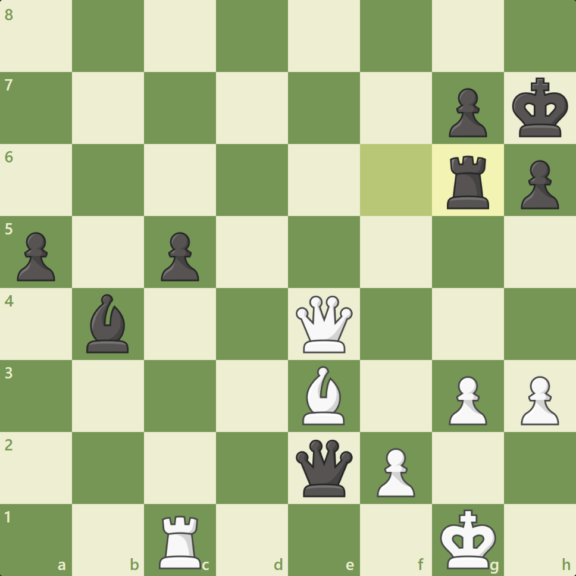
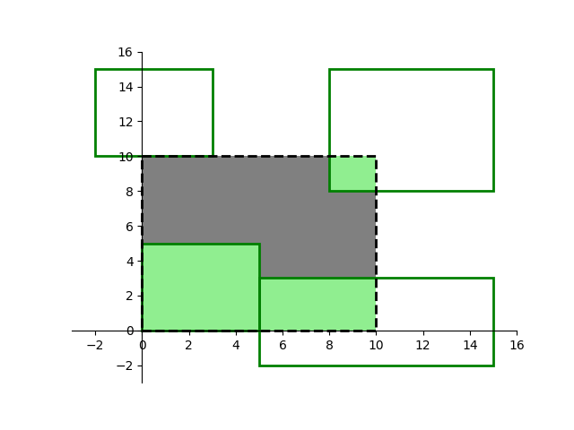
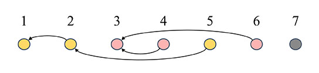
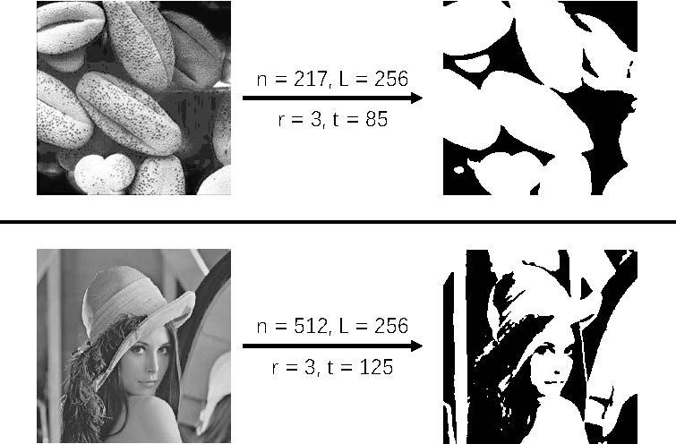

# 202406：200[模拟考试]✅

| 试题编号： | 202406-1         |
| ---------- | ---------------- |
| 试题名称： | 矩阵重塑（其一） |
| 时间限制： | 1.0s             |
| 内存限制： | 512.0MB          |
| 题目分类： | 暴力，模拟       |

## T1

### 题目背景

矩阵（二维）的重塑（reshape）操作是指改变矩阵的行数和列数，同时保持矩阵中元素的总数不变。

### 题目描述

矩阵的重塑操作可以具体定义为以下步骤：

设原矩阵为 M**M**，其维度为 n×m*n*×*m*，即有 n*n* 行和 m*m* 列。新矩阵为 M′**M**′，其维度为 p×q*p*×*q*。重塑操作要满足 n×m=p×q*n*×*m*=*p*×*q*，这保证了元素的总数不变。

1. **线性化原矩阵**：按照行优先的顺序，将原矩阵 M**M** 的元素转换成一个长度为 n×m*n*×*m* 的一维数组 A**A**。这意味着你先读取 M**M** 的第 00 行元素，然后是第 11 行，依此类推，直到最后一行。
2. **填充新矩阵**：使用一维数组 A**A** 中的元素按照行优先的顺序填充新矩阵 M′**M**′。首先填充 M′**M**′ 的第 00 行，直到该行有 q*q* 个元素，然后继续填充第 11 行，直到所有 p*p* 行都被填满。

给定原矩阵中的一个元素的位置 (i,j)(*i*,*j*)（0≤i<n0≤*i*<*n* 且 0≤j<m0≤*j*<*m*），我们可以找到这个元素在被线性化后的一维数组 A**A** 中的位置 k*k*（0≤k<n×m0≤*k*<*n*×*m*），然后确定它在新矩阵 M′**M**′ 中的位置 (i′,j′)(*i*′,*j*′)（0≤i′<p0≤*i*′<*p* 且 0≤j<q0≤*j*<*q*）。它们之间满足如下数学关系：i×m+j=k=i′×q+j′*i*×*m*+*j*=*k*=*i*′×*q*+*j*′

给定 n×m*n*×*m* 的矩阵 M**M** 和目标形状 p*p*、q*q*，试将 M**M** 重塑为 p×q*p*×*q* 的矩阵 M′**M**′。

### 输入格式

从标准输入读入数据。

输入共 n+1*n*+1 行。

输入的第一行包含四个正整数 n*n*、m*m* 和 p*p*、q*q*。

接下来依次输入原矩阵 M**M** 的第 00 到第 n−1*n*−1 行，每行包含 m*m* 个整数，按列下标从 00 到 m−1*m*−1 的顺序依次给出。

### 输出格式

输出到标准输出。

输出共 p*p* 行，每行 q*q* 个整数，表示重塑后的矩阵 M′**M**′。输出格式与输入相同，即依次输出 M′**M**′ 的第 00 行到第 p−1*p*−1 行；行内按列下标从 00 到 q−1*q*−1 的顺序输出，且两个整数间仅用一个空格分隔。

### 样例1输入

```plain
2 3 3 2
1 2 3
4 5 6
```

### 样例1输出

```plain
1 2
3 4
5 6
```

### 样例2输入

```plain
2 2 1 4
6 6
6 6
```

### 样例2输出

```plain
6 6 6 6
```

### 子任务

全部的测试数据满足：

- n*n*、m*m* 和 p*p*、q*q* 均为正整数且 n×m=p×q≤104*n*×*m*=*p*×*q*≤104；
- 输入矩阵中每个元素的绝对值不超过 10001000。

### 提示

评测环境仅提供各语言的标准库，特别地，不提供任何线性代数库（如 `numpy`、`pytorch` 等）。

### 代码

```c++
#include<bits/stdc++.h>

using namespace std;

int main(){
  int n,m,p,q;
  cin>>n>>m>>p>>q;
  vector<int>mv1;
  vector<vector<int>>mv2(p,vector<int>(q,0));
  for(int i=0;i<n*m;i++){
    int t;cin>>t;
    mv1.push_back(t);
  }
  int cnt=0;
  for(int i=0;i<p;i++){
    for(int j=0;j<q;j++){
      mv2[i][j]=mv1[cnt++];
    }
  }
  for(auto it:mv2){
    for(auto itt:it){
      cout<<itt<<" ";
    }
    cout<<endl;
  }
  return 0;
}
```

## T2

| 试题编号： | 202406-2         |
| ---------- | ---------------- |
| 试题名称： | 矩阵重塑（其二） |
| 时间限制： | 1.0s             |
| 内存限制： | 512.0MB          |
| 题目分类： | 矩阵，操作       |

### 题目背景

矩阵转置操作是将矩阵的行和列交换的过程。在转置过程中，原矩阵 A**A** 的元素 aij*a**ij* 会移动到转置后的矩阵 AT**A***T* 的 aji*a**ji* 的位置。这意味着 A**A** 的第 i*i* 行第 j*j* 列的元素在 AT**A***T* 中成为了第 j*j* 行第 i*i* 列的元素。

例如，有矩阵 A**A** 如下：

A=[abcdef]**A**=[*a**d**b**e**c**f*]

它的转置矩阵 AT**A***T* 会是：

AT=[adbecf]**A***T*=*a**b**c**d**e**f*

矩阵转置在线性代数中是一个基本操作，广泛应用于各种数学和工程领域。

### 题目描述

给定 n×m*n*×*m* 的矩阵 M**M**，试编写程序支持以下查询和操作：

1. **重塑操作 p\*p\*、q\*q\***：将当前矩阵重塑为 p×q*p*×*q* 的形状（重塑的具体定义见上一题）；
2. **转置操作**：将当前矩阵转置；
3. **元素查询 i\*i\*、j\*j\***：查询当前矩阵第 i*i* 行 j*j* 列的元素（0≤i<n0≤*i*<*n* 且 0≤j<m0≤*j*<*m*）。

依次给出 t*t* 个上述查询或操作，计算其中每个查询的结果。

### 输入格式

从标准输入读入数据。

输入共 n+t+1*n*+*t*+1 行。

输入的第一行包含三个正整数 n*n*、m*m* 和 t*t*。

接下来依次输入初始矩阵 M**M** 的第 00 到第 n−1*n*−1 行，每行包含 m*m* 个整数，按列下标从 00 到 m−1*m*−1 的顺序依次给出。

接下来输入 t*t* 行，每行包含形如 `op a b` 的三个整数，依次给出每个查询或操作。具体输入格式如下：

- 重塑操作：`1 p q`
- 转置操作：`2 0 0`
- 元素查询：`3 i j`

### 输出格式

输出到标准输出。

每个查询操作输出一行，仅包含一个整数表示查询结果。

### 样例1输入

```plain
3 2 3
1 2
3 4
5 6
3 0 1
1 2 3
3 1 2
```

### 样例1输出

```plain
2
6
```

### 样例2输入

```plain
3 2 5
1 2
3 4
5 6
3 1 0
2 0 0
3 1 0
1 3 2
3 1 0
```

### 样例2输出

```plain
3
2
5
```

初始矩阵： [123456]135246， (1,0)(1,0) 位置元素为 33；

转置后： [135246][123456]， (1,0)(1,0) 位置元素为 22；

重塑后： [135246]154326， (1,0)(1,0) 位置元素为 55。

### 子任务

8080 的测试数据满足：

- t≤100*t*≤100；

全部的测试数据满足：

- t≤105*t*≤105 且其中转置操作的次数不超过 100100；
- n*n*、m*m* 和所有重塑操作中的 p*p*、q*q* 均为正整数且 n×m=p×q≤104*n*×*m*=*p*×*q*≤104；
- 输入矩阵中每个元素的绝对值不超过 10001000。

### 提示

- 对于 n×m*n*×*m* 的矩阵，虽然转置和重塑操作都可以将矩阵形态变为 m×n*m*×*n*，但这两种操作通常会导致不同的结果。
- 评测环境仅提供各语言的标准库，特别地，不提供任何线性代数库（如 `numpy`、`pytorch` 等）。

> 其实题目就是提示k的使用，利用好k就行，不可能每次都去操作，不然必然超时啊，利用好k保持/维护一个一维数组就行了。

### 代码

```c++
#include<bits/stdc++.h>

using namespace std;

// 单独处理转置操作
void getM(vector<int>&ori,int n,int m){
  // n和m是新行新列
  // 那么原先就是m行n列
  vector<vector<int>>mv1(m,vector<int>(n,0));
  int cnt=0;
  for(int i=0;i<m;i++){
    for(int j=0;j<n;j++){
      mv1[i][j]=ori[cnt++];
    }
  }
  cnt=0;
  for(int i=0;i<n;i++){
    for(int j=0;j<m;j++){
      ori[cnt++]=mv1[j][i];
    }
  }
}

int main(){
  int n,m,t;
  cin>>n>>m>>t;  // 总是记录当前行和当前列
  vector<int>ori(n*m,0);
  for(int i=0;i<n*m;i++){
    cin>>ori[i];
  }
  for(int i=0;i<t;i++){
    // for(auto it:ori){
    //   cout<<it<<" ";
    // }
    // cout<<endl;
    // cout<<"n="<<n<<" m="<<m<<endl;
    int t1,t2,t3;
    cin>>t1>>t2>>t3;
    if(t1==1){
      n=t2;m=t3;
    }
    else if(t1==2){
      swap(n,m);
      getM(ori,n,m);
    }
    else if(t1==3){
      // t1和t2是查询的行和列 n和m是矩阵存储的行和列
      // cout<<"here n="<<n<<" m="<<m<<endl;
      // for(auto it:ori){
      //   cout<<it<<" ";
      // }
      // cout<<endl;
      int k=t2*m+t3;
      // cout<<"k="<<k<<endl;
      cout<<ori[k]<<endl;
    }
  }
    return 0;
}
// 如果每次都得全部操作一遍显然超时，只能拿到80分
// 如果只是置换的话每个元素的位置都不变，但是思考转置之后的元素变化，或者说我就没次转置的时候改变一次数组？
// 别想太多好吧，也没什么难的，稍微优化下选数据就行了
```

> 大体刷题已经结束，剩下来就是优化了

# 202312：200✅

## T1

| 试题编号： | 202312-1   |
| ---------- | ---------- |
| 试题名称： | 仓库规划   |
| 时间限制： | 1.0s       |
| 内存限制： | 512.0MB    |
| 题目分类： | 暴力，枚举 |

### 问题描述

西西艾弗岛上共有 n 个仓库，依次编号为 1⋯n。每个仓库均有一个 m 维向量的位置编码，用来表示仓库间的物流运转关系。

具体来说，每个仓库 i 均可能有一个**上级**仓库 j，满足：仓库 j 位置编码的每一维**均大于**仓库 i 位置编码的对应元素。比如编码为 (1,1,1) 的仓库可以成为 (0,0,0) 的上级，但不能成为 (0,1,0) 的上级。如果有多个仓库均满足该要求，则选取其中编号最小的仓库作为仓库 i 的上级仓库；如果没有仓库满足条件，则说明仓库 i 是一个物流中心，没有上级仓库。

现给定 n 个仓库的位置编码，试计算每个仓库的上级仓库编号。

### 输入格式

从标准输入读入数据。

输入共 n+1 行。

输入的第一行包含两个正整数 n 和 m，分别表示仓库个数和位置编码的维数。

接下来 n 行依次输入 n 个仓库的位置编码。其中第 i 行（1≤i≤n）包含 m 个整数，表示仓库 i 的位置编码。

### 输出格式

输出到标准输出。

输出共 n 行。

第 i 行（1≤i≤n）输出一个整数，表示仓库 i 的上级仓库编号；如果仓库 i 没有上级，则第 i 行输出 0。

### 样例输入

```data
4 2
0 0
-1 -1
1 2
0 -1
```

### 样例输出

```data
3
1
0
3
```

### 样例解释

对于仓库 2:(−1,−1) 来说，仓库 1:(0,0) 和仓库 3:(1,2) 均满足上级仓库的编码要求，因此选择编号较小的仓库 1 作为其上级。

### 子任务

50% 的测试数据满足 m=2；

全部的测试数据满足 0<m≤10、0<n≤1000，且位置编码中的所有元素均为**绝对值**不大于 106 的整数。

### 题解

代码如下：
```c++
#include <bits/stdc++.h>

using namespace std;

int main() {
  int n, m;
  cin >> n >> m;
  // 获取初始n和m的值 n表示n个仓库，m表示m个编码 -> 快速根据m构建m个元素的仓库
  vector<vector<int> > a(n + 1, vector<int>(m));
  // 这里注意创建vector的语法
  for (int i = 1; i <= n; i++) {  // 仓库编号从1开始，编码编号从0开始
    for (int j = 0; j < m; j++) {
      cin >> a[i][j];
    }
  }
  for (int i = 1; i <= n; i++) {  // i为上层
    // cout << "here i=" << i << endl;
    int flag = 1;
    for (int j = 1; j <= n; j++) {  // j为内层
      if (j == i) continue;
      // cout << "here j=" << j << endl;
      flag = 1;
      for (int k = 0; k < m; k++) {
        if (a[i][k] >= a[j][k]) {
          flag = 0;
          break;
        }
      }
      // cout << "here flag=" << flag << endl;
      if (flag == 1) {
        cout << j << endl;
        break;
      }
    }
    if (flag == 0) {
      cout << 0 << endl;
    }
  }
}
```

### 核心语句

#### 1.核心语法

```c++
vector<vector<int> > a(n + 1, vector<int>(m));
// 左边是数组个数。右边看作是每个元素含有的元素个数
```

#### 2.核心设计

> 暴力枚举：好在不会超时，flag的设计稍微繁琐了：不过按照自己的方式来就好

```c++
for (int i = 1; i <= n; i++) {  // i为上层
    // cout << "here i=" << i << endl;
    int flag = 1;
    for (int j = 1; j <= n; j++) {  // j为内层
      if (j == i) continue;
      // cout << "here j=" << j << endl;
      flag = 1;
      for (int k = 0; k < m; k++) {
        if (a[i][k] >= a[j][k]) {
          flag = 0;
          break;
        }
      }
      // cout << "here flag=" << flag << endl;
      if (flag == 1) {
        cout << j << endl;
        break;
      }
    }
    if (flag == 0) {
      cout << 0 << endl;
    }
```

-----

## T2

| 试题编号： | 202312-2                  |
| ---------- | ------------------------- |
| 试题名称： | 因子化简                  |
| 时间限制： | 2.0s                      |
| 内存限制： | 512.0MB                   |
| 题目分类： | 质因数分解，map，朴素算法 |

### 题目背景

质数（又称“素数”）是指在大于 1 的自然数中，除了 1 和它本身以外不再有其他因数的自然数。

### 问题描述

小 P 同学在学习了素数的概念后得知，任意的正整数 n 都可以唯一地表示为若干素因子相乘的形式。如果正整数 n 有 m 个不同的素数因子 p1,p2,⋯,pm，则可以表示为：n=p1t1×p2t2×⋯×pmtm。

小 P 认为，每个素因子对应的指数 ti 反映了该素因子对于 n 的重要程度。现设定一个阈值 k，如果某个素因子 pi 对应的指数 ti **小于** k，则认为该素因子不重要，可以将 piti 项从 n 中除去；反之则将 piti 项保留。最终剩余项的乘积就是 n 简化后的值，如果**没有剩余项**则认为简化后的值等于 1。

试编写程序处理 q 个查询：

- 每个查询包含两个正整数 n 和 k，要求计算按上述方法将 n 简化后的值。

### 输入格式

从标准输入读入数据。

输入共 q+1 行。

输入第一行包含一个正整数 q，表示查询的个数。

接下来 q 行每行包含两个正整数 n 和 k，表示一个查询。

### 输出格式

输出到标准输出。

输出共 q 行。

每行输出一个正整数，表示对应查询的结果。

### 样例输入

```data
3
2155895064 3
2 2
10000000000 10
```

### 样例输出

```data
2238728
1
10000000000
```

### 样例解释

查询一：

- n=23×32×234×107
- 其中素因子 3 指数为 2，107 指数为 1。将这两项从 n 中除去后，剩余项的乘积为 23×234=2238728。

查询二：

- 所有项均被除去，输出 1。

查询三：

- 所有项均保留，将 n 原样输出。

### 子任务

40% 的测试数据满足：n≤1000；

80% 的测试数据满足：n≤10 5；

全部的测试数据满足：1<n≤10 10 且 1<k,q≤10。

### 题解

我有点惯性思维啦emm，就用最朴素的方法就能拿到大部分分数了

> 下面是朴素的素数筛法，这种朴素的素数筛怎么会想不到呢

```c++
#include <bits/stdc++.h>
using namespace std;

int main() {
  int k;
  scanf("%d", &k);
  while (k--) {
    long long a, b;
    cin >> a >> b;
    long long int x = a + b;
    int ans = 1;
    for (int i = 2; i * i <= x; i++) {
      if (x % i == 0) {
        int count = 0;
        while (x % i == 0) {
          count++;  
          x /= i; 
        }
        ans = ans * (count + 1);
      }
    }
    // 下面是获取到总因子的数量
    if (x != 1) printf("%d\n", ans * 2); 
    else
      printf("%d\n", ans);
  }
}
```

代码如下：

```c++
#include <bits/stdc++.h>

using namespace std;

// 题目本身不难，难的是素因数分解板子
int main() {
  int q;
  cin >> q;
  while (q--) {
    long long int n;
    int k;
    cin >> n >> k;
    map<int, int> mp;
    for (int i = 2; i * i <= n; i++) {
      if (n % i == 0) {
        int cnt = 0;
        while (n % i == 0) {
          n /= i;
          cnt++;
        }
        mp[i] = cnt;
      }
    }
    if (n != 1) {
      mp[n] = 1;
    }
    // for (auto &it : mp) {
    //   cout << it.first << " " << it.second << endl;
    // }
    // cout << n << endl;
    // 为什么这里除不干净呀,需要为不是1的情况单独处理

    long long int ret = 1;
    for (auto &it : mp) {
      if (it.second >= k) {
        for (int i = 0; i < it.second; i++) {
          ret *= it.first;
        }
      }
    }
    cout << ret << endl;
  }
  return 0;
}
```

> 关于素数筛再去熟练一下
>
> 总想着曾经好像质数分解的方法，其实都是基于最简单的素数筛呢
>
> 前两题朴素啊朴素啊
>
> 这题本身也要剥离下素数筛，不然难度臆想啦

# 202309：180✅

## T1

| 试题编号： | 202309-1         |
| ---------- | ---------------- |
| 试题名称： | 坐标变换（其一） |
| 时间限制： | 1.0s             |
| 内存限制： | 512.0MB          |
| 题目类型： | 模拟，前缀和     |

### 问题描述

对于平面直角坐标系上的坐标 (x,y)，小 P 定义了一个包含 n 个操作的序列 T=(t1,t2,⋯,tn)。其中每个操作 ti（1≤i≤n）包含两个参数 dxi 和 dyi，表示将坐标 (x,y) 平移至 (x+dxi,y+dyi) 处。

现给定 m 个初始坐标，试计算对每个坐标 (xj,yj)（1≤j≤m）依次进行 T 中 n 个操作后的最终坐标。

### 输入格式

从标准输入读入数据。

输入共 n+m+1 行。

输入的第一行包含空格分隔的两个正整数 n 和 m，分别表示操作和初始坐标个数。

接下来 n 行依次输入 n 个操作，其中第 i（1≤i≤n）行包含空格分隔的两个整数 dxi、dyi。

接下来 m 行依次输入 m 个坐标，其中第 j（1≤j≤m）行包含空格分隔的两个整数 xj、yj。

### 输出格式

输出到标准输出中。

输出共 m 行，其中第 j（1≤j≤m）行包含空格分隔的两个整数，表示初始坐标 (xj,yj) 经过 n 个操作后的位置。

### 样例输入

```data
3 2
10 10
0 0
10 -20
1 -1
0 0
```

### 样例输出

```data
21 -11
20 -10
```

### 样例说明

第一个坐标 (1,−1) 经过三次操作后变为 (21,−11)；第二个坐标 (0,0) 经过三次操作后变为 (20,−10)。

### 评测用例规模与约定

全部的测试数据满足：n,m≤100，所有输入数据（x,y,dx,dy）均为整数且绝对值不超过 100000。

60分代码：

```c++
#include <bits/stdc++.h>

using namespace std;

int main() {
  int n, m;
  cin >> n >> m;
  // 由于行数是对应的所以不能使用map
  vector<vector<int> > a(1, vector<int>(2));
  vector<vector<int> > b(m + 1, vector<int>(2));
  for (int i = 1; i <= n; i++) {
    int dx, dy;
    cin >> dx >> dy;
    a[0][0] += dx;
    a[0][1] += dy;
  }
  for (int i = 1; i <= m; i++) {
    int x, y;
    cin >> x >> y;
    b[i][0] = x;
    b[i][1] = y;
  }
  for (int i = 1; i <= m; i++) {
    if (i > n) break;
    b[i][0] += a[0][0];
    b[i][1] += a[0][1];
  }
  // cout << endl << "-----------";
  for (int i = 1; i <= m; i++) {
    cout << b[i][0] << " " << b[i][1] << endl;
  }
}
```

正解代码：

```c++
#include <bits/stdc++.h>

using namespace std;

int main() {
  int n, m;
  cin >> n >> m;
  // 由于行数是对应的所以不能使用map
  long long int a[1][2] = {0};
  vector<vector<long> > b(m + 1, vector<long>(2));
  for (int i = 1; i <= n; i++) {
    int dx, dy;
    cin >> dx >> dy;
    a[0][0] += dx;
    a[0][1] += dy;
  }
  for (int i = 1; i <= m; i++) {
    int x, y;
    cin >> x >> y;
    b[i][0] = x;
    b[i][1] = y;
  }
  for (int i = 1; i <= m; i++) {
    b[i][0] += a[0][0];
    b[i][1] += a[0][1];
  }
  // cout << endl << "-----------";
  for (int i = 1; i <= m; i++) {
    cout << b[i][0] << " " << b[i][1] << endl;
  }
}
```

> 问题应该不是出来long那里，是
>
> ```c++
> if (i > n) break;
> // 这句代码是在错误的理解下的产物
> ```

>题目还是一定要看清，多去理解几遍，尤其是测试样例，都去看几遍，这样自己的模拟就不容易出错

## T2

| 试题编号： | 202309-2                 |
| ---------- | ------------------------ |
| 试题名称： | 坐标变换（其二）         |
| 时间限制： | 2.0s                     |
| 内存限制： | 512.0MB                  |
| 题目类型： | 变换，模拟，前缀和，差分 |

### 问题描述

对于平面直角坐标系上的坐标 (x,y)，小 P 定义了如下两种操作：

1. 拉伸 k 倍：横坐标 x 变为 kx，纵坐标 y 变为 ky；
2. 旋转 θ：将坐标 (x,y) 绕坐标原点 (0,0) **逆时针**旋转 θ 弧度（0≤θ<2π）。易知旋转后的横坐标为 xcos⁡θ−ysin⁡θ，纵坐标为 xsin⁡θ+ycos⁡θ。

设定好了包含 n 个操作的序列 (t1,t2,⋯,tn) 后，小 P 又定义了如下查询：

- `i j x y`：坐标 (x,y) 经过操作 ti,⋯,tj（1≤i≤j≤n）后的新坐标。

对于给定的操作序列，试计算 m 个查询的结果。

### 输入格式

从标准输入读入数据。

输入共 n+m+1 行。

输入的第一行包含空格分隔的两个正整数 n 和 m，分别表示操作和查询个数。

接下来 n 行依次输入 n 个操作，每行包含空格分隔的一个整数（操作类型）和一个实数（k 或 θ），形如 1 k（表示拉伸 k 倍）或 2 θ（表示旋转 θ）。

接下来 m 行依次输入 m 个查询，每行包含空格分隔的四个整数 i、j、x 和 y，含义如前文所述。

### 输出格式

输出到标准输出中。

输出共 m 行，每行包含空格分隔的两个实数，表示对应查询的结果。

### 样例输入

```data
10 5
2 0.59
2 4.956
1 0.997
1 1.364
1 1.242
1 0.82
2 2.824
1 0.716
2 0.178
2 4.094
1 6 -953188 -946637
1 9 969538 848081
4 7 -114758 522223
1 9 -535079 601597
8 8 159430 -511187
```

### 样例输出

```data
-1858706.758 -83259.993
-1261428.46 201113.678
-75099.123 -738950.159
-119179.897 -789457.532
114151.88 -366009.892
```

### 样例说明

第五个查询仅对输入坐标使用了操作八：拉伸 0.716 倍。

横坐标：159430×0.716=114151.88

纵坐标：−511187×0.716=−366009.892

由于具体计算方式不同，程序输出结果可能与真实值有微小差异，样例输出仅保留了三位小数。

### 评测用例规模与约定

80% 的测试数据满足：n,m≤1000；

全部的测试数据满足：

- n,m≤100000；
- 输入的坐标均为整数且绝对值不超过 1000000；
- 单个拉伸操作的系数 k∈[0.5,2]；
- 任意操作区间 ti,⋯,tj（1≤i≤j≤n）内拉伸系数 k 的乘积在 [0.001,1000] 范围内。

### 评分方式

如果你输出的浮点数与参考结果相比，满足绝对误差不大于 0.1，则该测试点满分，否则不得分。

### 提示

- C/C++：建议使用 `double` 类型存储浮点数，并使用 `scanf("%lf", &x);` 进行输入，`printf("%f", x);` 输出，也可以使用 `cin` 和 `cout` 输入输出浮点数；`#include <math.h>` 后可使用三角函数 `cos()` 和 `sin()`。
- Python：直接使用 `print(x)` 即可输出浮点数 `x`；`from math import cos, sin` 后可使用相应三角函数。
- Java：建议使用 `double` 类型存储浮点数，可以使用 `System.out.print(x);` 进行输出；可使用 `Math.cos()` 和 `Math.sin()` 调用三角函数。

### 代码

> 80分超时代码如下：

```c++
#include <bits/stdc++.h>

using namespace std;

void func1(double k, double &x, double &y) {
  x = x * k;
  y = y * k;
}

void func2(double k, double &x, double &y) {
  double tmp = x;
  x = x * cos(k) - y * sin(k);
  y = tmp * sin(k) + y * cos(k);
  // 这种细节错误不要犯噢
}

int main() {
  ios::sync_with_stdio(false);
  cin.tie(0);
  cout.tie(0);
  // 加速cin/cout
  int n, m;
  cin >> n >> m;
  vector<int> n1(n + 1);
  vector<double> n2(n + 1);
  // 初始化n数组
  for (int i = 1; i <= n; i++) {
    int x;
    double y;
    cin >> x >> y;
    n1[i] = x;
    n2[i] = y;
  }
  // 导入数据：忽略第0空间

  vector<vector<double> > ret(m + 1, vector<double>(2));
  // 牢记这种初始化方式
  for (int k = 1; k <= m; k++) {
    int i, j;
    double x, y;
    cin >> i >> j;
    cin >> x >> y;
    for (int l = i; l <= j; l++) {
      if (n1[l] == 1) {
        func1(n2[l], x, y);
      } else {
        func2(n2[l], x, y);
      }
    }
    // ret[k][0] = x;
    // ret[k][1] = y;
    printf("%.3f %.3f\n", x, y);
    // 依旧运行超时？
  }
  // for (int i = 1; i <= m; i++) {
  //   printf("%.3f %.3f\n", ret[i][0], ret[i][1]);
  // }
  return 0;
}
```

> 遍历了多层for循环导致超时，如何优化时间呢？
>
> 从i到j到操作应该可以用1来模拟
>
> 输入参数直接乘积对应输出结果就行

优化代码

> 优化不了啊，由于旋转变换导致无法状态继承之前的积
>
> 故参考下题解
>
> 分别继承k和角度，最后进行一次变换即可
>
> 下面是参考题解的满分代码
>
> 这题多思考一下没什么问题

```c++
#include <bits/stdc++.h>

using namespace std;

void func1(double k, double &x, double &y) {
  x = x * k;
  y = y * k;
}

void func2(double k, double &x, double &y) {
  double tmp = x;
  x = x * cos(k) - y * sin(k);
  y = tmp * sin(k) + y * cos(k);
}

int main() {
  ios::sync_with_stdio(false);
  cin.tie(0);
  cout.tie(0);
  int n, m;
  cin >> n >> m;
  vector<vector<double> > op(n + 1, vector<double>(2));
  op[0][0] = 1;
  op[0][1] = 0;
  for (int kk = 1; kk <= n; kk++) {
    int opp;
    double k;
    cin >> opp >> k;
    if (opp == 1) {
      op[kk][0] = k;
      op[kk][1] = 0;
    } else {
      op[kk][0] = 1;
      op[kk][1] = k;
    }
  }
  for (int i = 1; i <= n; ++i) {
    op[i][0] *= op[i - 1][0];  // 乘积的倍数k累积
    op[i][1] += op[i - 1][1];  // 角度累积
  }

  for (int k = 1; k <= m; k++) {
    int i, j;
    double x, y;
    cin >> i >> j;
    cin >> x >> y;
    func1(op[j][0] / op[i - 1][0], x, y);
    func2(op[j][1] - op[i - 1][1], x, y);
    printf("%.3f %.3f\n", x, y);
  }
}
```

> 我是想着继承结果，原来继承参数就好了啊 ！

# 202305：100❌

## T1

| 试题编号： | 202305-1         |
| ---------- | ---------------- |
| 试题名称： | 重复局面         |
| 时间限制： | 1.0s             |
| 内存限制： | 512.0MB          |
| 问题分类： | 枚举，字符串处理 |

### 题目背景

国际象棋在对局时，同一局面连续或间断出现3次或3次以上，可由任意一方提出和棋。

### 问题描述

国际象棋每一个局面可以用大小为 8×8 的字符数组来表示，其中每一位对应棋盘上的一个格子。六种棋子王、后、车、象、马、兵分别用字母 `k`、`q`、`r`、`b`、`n`、`p` 表示，其中大写字母对应白方、小写字母对应黑方。棋盘上无棋子处用字符 `*` 表示。两个字符数组的每一位均相同则说明对应同一局面。

现已按上述方式整理好了每步棋后的局面，试统计每个局面分别是第几次出现。



### 输入格式

从标准输入读入数据。

输入的第一行包含一个正整数 n，表示这盘棋总共有 n 步。

接下来 8×n 行，依次输入第 1 到第 n 步棋后的局面。具体来说每行包含一个长度为 8 的字符串，每 8 行字符串共 64 个字符对应一个局面。

### 输出格式

输出到标准输出中。

输出共 n 行，每行一个整数，表示该局面是第几次出现。

### 样例输入

```data
8
********
******pk
*****r*p
p*pQ****
********
**b*B*PP
****qP**
**R***K*
********
******pk
*****r*p
p*pQ****
*b******
****B*PP
****qP**
**R***K*
********
******pk
*****r*p
p*p*****
*b**Q***
****B*PP
****qP**
**R***K*
******k*
******p*
*****r*p
p*p*****
*b**Q***
****B*PP
****qP**
**R***K*
******k*
******p*
*****r*p
p*pQ****
*b******
****B*PP
****qP**
**R***K*
********
******pk
*****r*p
p*pQ****
*b******
****B*PP
****qP**
**R***K*
********
******pk
*****r*p
p*p*****
*b**Q***
****B*PP
****qP**
**R***K*
********
******pk
******rp
p*p*****
*b**Q***
****B*PP
****qP**
**R***K*
```

### 样例输出

```data
1
1
1
1
1
2
2
1
```

### 样例说明

第 6、7 步后的局面分别与第 2、3 步后的局面相同。第 8 步后的局面与上图相对应。

### 子任务

输入数据满足 n≤100。

### 提示

判断重复局面仅涉及字符串比较，无需考虑国际象棋实际行棋规则。

> 千万强调下字符串处理

### 代码

```c++
#include <iostream>
#include <map>
#include <string>
// #include<bits/stdc++.h>

using namespace std;

// 将8行矩阵作为一个字符串处理即可
int main() {
  // ios::sync_with_stdio(false);
  // cin.tie(0);
  // cout.tie(0);
  int n;
  cin >> n;
  getchar();
  // 向这里数字转字符务必使用getchar()，否则会出现错误
  string a[n];
  map<int, int> mp;
  int cnt = 0;
  int tmp = n;
  while (n--) {
    string s;
    for (int i = 0; i < 8; i++) {
      string t;
      getline(cin, t);
      s += t;
    }
    a[cnt++] = s;
  }
  for (int i = 0; i < tmp; i++) {
    mp[i] = 0;
    for (int j = 0; j <= i; j++) {
      if (a[i] == a[j]) {
        mp[i]++;
      }
    }
  }
  for (auto &i : mp) {
    cout << i.second << endl;
  }
  return 0;
}
// 暴力枚举检索，怎么会出错呢？从原理上来说不应该啊？
```

> 代码没有问题，理所当然是满分，稍微注意下判题系统，似乎是头文件的问题，待进一步慢慢调试发现，注意看上面的注释掉的代码
>
> 测试发现万能头文件没问题，问题出在 解除绑定 cin和cout上，看来没事不用用那个，除非题目分数给TLE了

## T2

| 试题编号： | 202305-2                 |
| ---------- | ------------------------ |
| 试题名称： | 矩阵运算                 |
| 时间限制： | 5.0s                     |
| 内存限制： | 512.0MB                  |
| 题目类型： | 模拟，循环，矩阵运算顺序 |

### 题目背景

Softmax(Q×KTd)×V 是 Transformer 中注意力模块的核心算式，其中 Q、K 和 V 均是 n 行 d 列的矩阵，KT 表示矩阵 K 的转置，× 表示矩阵乘法。

### 问题描述

为了方便计算，顿顿同学将 Softmax 简化为了点乘一个大小为 n 的一维向量 W：
`(W⋅(Q×K^T))×V`
点乘即对应位相乘，记 W(i) 为向量 W 的第 i 个元素，即将 (Q×KT) 第 i 行中的每个元素都与 W(i) 相乘。

现给出矩阵 Q、K 和 V 和向量 W，试计算顿顿按简化的算式计算的结果。

### 输入格式

从标准输入读入数据。

输入的第一行包含空格分隔的两个正整数 n 和 d，表示矩阵的大小。

接下来依次输入矩阵 Q、K 和 V。每个矩阵输入 n 行，每行包含空格分隔的 d 个整数，其中第 i 行的第 j 个数对应矩阵的第 i 行、第 j 列。

最后一行输入 n 个整数，表示向量 W。

### 输出格式

输出到标准输出中。

输出共 n 行，每行包含空格分隔的 d 个整数，表示计算的结果。

### 样例输入

```data
3 2
1 2
3 4
5 6
10 10
-20 -20
30 30
6 5
4 3
2 1
4 0 -5
```

### 样例输出

```data
480 240
0 0
-2200 -1100
```

### 子任务

70 的测试数据满足：n≤100 且 d≤10；输入矩阵、向量中的元素均为整数，且绝对值均不超过 30。

全部的测试数据满足：n≤104 且 d≤20；输入矩阵、向量中的元素均为整数，且绝对值均不超过 1000。

### 提示

请谨慎评估矩阵乘法运算后的数值范围，并使用适当数据类型存储矩阵中的整数。

> 模拟运算即可，本质上没有难度

### 代码

> 70分超时代码如下

```c++
#include <iostream>
#include <vector>

using namespace std;

void getMatrix(vector<vector<long long int>> &matrix, int n, int d) {
  for (int i = 1; i <= n; i++) {
    for (int j = 1; j <= d; j++) {
      cin >> matrix[i][j];
    }
  }
}

void getTMatrix(vector<vector<long long int>> &from,
                vector<vector<long long int>> &to, int n, int d) {
  for (int i = 1; i <= n; i++) {
    for (int j = 1; j <= d; j++) {
      to[j][i] = from[i][j];
    }
  }
}

int main() {
  long long int n, d;
  cin >> n >> d;
  vector<vector<long long int>> Q(n + 1, vector<long long int>(d + 1));
  vector<vector<long long int>> K(n + 1, vector<long long int>(d + 1));
  vector<vector<long long int>> V(n + 1, vector<long long int>(d + 1));
  getMatrix(Q, n, d);
  getMatrix(K, n, d);
  getMatrix(V, n, d);
  // 获取三个初始矩阵，这里应该不会超时吧

  vector<vector<long long int>> KT(d + 1, vector<long long int>(n + 1));
  getTMatrix(K, KT, n, d);
  // 获得转置矩阵

  vector<int> M(n + 1, 0);
  for (int i = 1; i <= n; i++) {
    cin >> M[i];
  }

  vector<vector<long long int>> QKT(n + 1, vector<long long int>(n + 1, 0));
  for (int i = 1; i <= n; i++) {
    for (int j = 1; j <= n; j++) {
      for (int k = 1; k <= d; k++) {
        QKT[i][j] += Q[i][k] * KT[k][j];
      }
    }
  }
  // n*d的矩阵和d*n的矩阵乘积，结果是n*n的矩阵
  // 举证乘积要求：：n d d n 中间两位相同即可

  for (int i = 1; i <= n; i++) {
    for (int j = 1; j <= n; j++) {
      QKT[i][j] = QKT[i][j] * M[i];
    }
  }
  // 点乘运算

  // 计算 QKT 和 V 的乘积
  vector<vector<long long int>> QKTV(n + 1, vector<long long int>(d + 1, 0));
  for (int i = 1; i <= n; i++) {
    for (int j = 1; j <= d; j++) {
      for (int k = 1; k <= n; k++) {
        QKTV[i][j] += QKT[i][k] * V[k][j];
      }
    }
  }
  // n*n的矩阵和n*d的矩阵，结果是n*d的矩阵

  // 输出 QKTV 矩阵
  for (int i = 1; i <= n; i++) {
    for (int j = 1; j <= d; j++) {
      cout << QKTV[i][j] << " ";
    }
    cout << endl;
  }

  return 0;
}
```

> 矩阵运算：
>
> 1. 打草稿
>
> 2. 核心明确结果矩阵的行和列
> 3. i和j控制结果矩阵的填值，k分别控制列和行的改变 
> 4. 几乎所有矩阵的乘积都满足第三点

优化代码

> 优化失败：依旧是70分超时

```c++
#include <iostream>
#include <vector>

using namespace std;

void getMatrix(vector<vector<long long int>> &matrix, int n, int d) {
  for (int i = 1; i <= n; i++) {
    for (int j = 1; j <= d; j++) {
      cin >> matrix[i][j];
    }
  }
}

void getTMatrix(vector<vector<long long int>> &from,
                vector<vector<long long int>> &to, int n, int d) {
  for (int i = 1; i <= n; i++) {
    for (int j = 1; j <= d; j++) {
      to[j][i] = from[i][j];
    }
  }
}

int main() {
  ios::sync_with_stdio(false);
  cin.tie(0);
  cout.tie(0);
  long long int n, d;
  cin >> n >> d;
  vector<vector<long long int>> Q(n + 1, vector<long long int>(d + 1));
  vector<vector<long long int>> K(n + 1, vector<long long int>(d + 1));
  vector<vector<long long int>> V(n + 1, vector<long long int>(d + 1));
  getMatrix(Q, n, d);
  getMatrix(K, n, d);
  getMatrix(V, n, d);

  vector<vector<long long int>> KT(d + 1, vector<long long int>(n + 1));
  getTMatrix(K, KT, n, d);

  vector<int> M(n + 1, 0);
  for (int i = 1; i <= n; i++) {
    cin >> M[i];
  }

  vector<vector<long long int>> QKT(n + 1, vector<long long int>(n + 1, 0));
  for (int i = 1; i <= n; i++) {
    for (int j = 1; j <= n; j++) {
      for (int k = 1; k <= d; k++) {
        QKT[i][j] += Q[i][k] * KT[k][j];
      }
    }
  }

  for (int i = 1; i <= n; i++) {
    for (int j = 1; j <= n; j++) {
      QKT[i][j] = QKT[i][j] * M[i];
    }
  }

  // 计算 QKT 和 V 的乘积
  vector<vector<long long int>> QKTV(n + 1, vector<long long int>(d + 1, 0));
  for (int i = 1; i <= n; i++) {
    for (int j = 1; j <= d; j++) {
      for (int k = 1; k <= n; k++) {
        QKTV[i][j] += QKT[i][k] * V[k][j];
      }
      cout << QKTV[i][j] << " ";
    }
    cout << endl;
  }

  return 0;
}
```

### 优化代码

> 优化失败：依旧超时，三个代码均为70分，没啥太大差异

```c++
#include <iostream>
#include <vector>

using namespace std;

void getMatrix(vector<vector<long long int>> &matrix, int n, int d) {
  for (int i = 1; i <= n; i++) {
    for (int j = 1; j <= d; j++) {
      cin >> matrix[i][j];
    }
  }
}

int main() {
  ios::sync_with_stdio(false);
  cin.tie(0);
  cout.tie(0);
  
  long long int n, d;
  cin >> n >> d;
  
  vector<vector<long long int>> Q(n + 1, vector<long long int>(d + 1));
  vector<vector<long long int>> K(n + 1, vector<long long int>(d + 1));
  vector<vector<long long int>> V(n + 1, vector<long long int>(d + 1));
  
  getMatrix(Q, n, d);
  getMatrix(K, n, d);
  getMatrix(V, n, d);

  vector<int> M(n + 1, 0);
  for (int i = 1; i <= n; i++) {
    cin >> M[i];
  }

  // 计算 QKT 和 V 的乘积
  vector<vector<long long int>> QKTV(n + 1, vector<long long int>(d + 1, 0));
  for (int i = 1; i <= n; i++) {
    for (int j = 1; j <= d; j++) {
      long long int sum = 0;
      for (int k = 1; k <= n; k++) {
        long long int qkt = 0;
        for (int l = 1; l <= d; l++) {
          qkt += Q[i][l] * K[k][l];
        }
        qkt *= M[i];
        sum += qkt * V[k][j];
      }
      QKTV[i][j] = sum;
      cout << QKTV[i][j] << " ";
    }
    cout << endl;
  }
  return 0;
}
```

> 参考题解：
>
> 这里涉及一个矩阵的乘法运算的优化运算，n a 和 a n的矩阵的乘法结果是n n的矩阵，需要调整乘法的顺序降低过程矩阵的长度
>
> 使用乘法结合律调整顺序即可

# 202303：0❌

## T1

| 试题编号： | 202303-1                     |
| ---------- | ---------------------------- |
| 试题名称： | 田地丈量                     |
| 时间限制： | 1.0s                         |
| 内存限制： | 512.0MB                      |
| 题目类型： | 暴力枚举，循环，矩形交集计算 |

### 问题描述

西西艾弗岛上散落着 n 块田地。每块田地可视为平面直角坐标系下的一块矩形区域，由左下角坐标 (x1,y1) 和右上角坐标 (x2,y2) 唯一确定，且满足 x1<x2、y1<y2。这 n 块田地中，任意两块的交集面积均为 0，仅边界处可能有所重叠。

最近，顿顿想要在南山脚下开垦出一块面积为 a×b 矩形田地，其左下角坐标为 (0,0)、右上角坐标为 (a,b)。试计算顿顿选定区域内已经存在的田地面积。

### 输入格式

从标准输入读入数据。

输入共 n+1 行。

输入的第一行包含空格分隔的三个正整数 n、a 和 b，分别表示西西艾弗岛上田地块数和顿顿选定区域的右上角坐标。

接下来 n 行，每行包含空格分隔的四个整数 x1、y1、x2 和 y2，表示一块田地的位置。

### 输出格式

输出到标准输出。

输出一个整数，表示顿顿选定区域内的田地面积。

### 样例输入

```data
4 10 10
0 0 5 5
5 -2 15 3
8 8 15 15
-2 10 3 15
```

### 样例输出

```data
44
```

### 样例解释

> 我能不能便利遍历每个矩阵的四个点，然后得到在矩形内的点？但是还有矩形外的点需要考虑，比如说跨过了整个矩形的情况

如图所示，选定区域内田地（绿色区域）面积为 44。



### 子任务

全部的测试数据满足 n≤100，且所有输入坐标的绝对值均不超过 104。

> 也就是已知基本坐标和干扰坐标，求完全未相交的面积
>
> 干扰坐标的交集为0
>
> 多读几遍题目，最后的输出结果是交集，绿色区域
>
> 那么既然干扰坐标面积的交集为0，那么枚举计算不就行了，都不需要考虑交集部分，暴力循环每个干扰坐标即可

### 代码

```c++
#include <bits/stdc++.h>

using namespace std;

int getArea(int x1, int y1, int x2, int y2, int x3, int y3, int x4, int y4) {
  int a1 = min(max(x1, x2), max(x3, x4));
  int a2 = min(max(y1, y2), max(y3, y4));
  int b1 = max(min(x1, x2), min(x3, x4));
  int b2 = max(min(y1, y2), min(y3, y4));
  if (a1 > b1 && a2 > b2) {
    return (a1 - b1) * (a2 - b2);
  }
  return 0;
}

int main() {
  int n, x1, y1;
  cin >> n >> x1 >> y1;
  int ret = 0;
  while (n--) {
    int x3, y3, x4, y4;
    cin >> x3 >> y3 >> x4 >> y4;
    ret += getArea(0, 0, x1, y1, x3, y3, x4, y4);
  }
  cout << ret << endl;
  return 0;
}
```

> 矩形的交集面积可以收录了，写起来发现没那么简单
>
> 我不好评价，google搜索的，蓝桥杯基础练习题，但凡懂这个算法就没丁点难度，但凡不懂的话考场多半写不出来。
>
> 算法我曾经见过，但是没有收录，“我爱笔记”！！

### 算法步骤

1. **计算相交区域的右上角坐标**：

   int a1 = min(max(x1, x2), max(x3, x4));

   int a2 = min(max(y1, y2), max(y3, y4));

   - [`a1`](vscode-file://vscode-app/Applications/Visual Studio Code.app/Contents/Resources/app/out/vs/code/electron-sandbox/workbench/workbench.html) 是两个矩形右边界的最小值。
   - [`a2`](vscode-file://vscode-app/Applications/Visual Studio Code.app/Contents/Resources/app/out/vs/code/electron-sandbox/workbench/workbench.html) 是两个矩形上边界的最小值。

2. **计算相交区域的左下角坐标**：

   int b1 = max(min(x1, x2), min(x3, x4));

   int b2 = max(min(y1, y2), min(y3, y4));

   - [`b1`](vscode-file://vscode-app/Applications/Visual Studio Code.app/Contents/Resources/app/out/vs/code/electron-sandbox/workbench/workbench.html) 是两个矩形左边界的最大值。
   - [`b2`](vscode-file://vscode-app/Applications/Visual Studio Code.app/Contents/Resources/app/out/vs/code/electron-sandbox/workbench/workbench.html) 是两个矩形下边界的最大值。

3. **判断是否相交并计算面积**：

   if (a1 > b1 && a2 > b2) {

    return (a1 - b1) * (a2 - b2);

   }

   return 0;

   - 如果 [`a1 > b1`](vscode-file://vscode-app/Applications/Visual Studio Code.app/Contents/Resources/app/out/vs/code/electron-sandbox/workbench/workbench.html) 且 [`a2 > b2`](vscode-file://vscode-app/Applications/Visual Studio Code.app/Contents/Resources/app/out/vs/code/electron-sandbox/workbench/workbench.html)，则两个矩形相交，返回相交区域的面积 `(a1 - b1) * (a2 - b2)`。
   - 否则，返回 0，表示两个矩形不相交。
   - 口诀：右上角两大取小，左下角两小取大

   > 也就是说直接按照相交计算得到相交区域左下角和右上角的坐标
   >
   > 最小的最大 最大的最小 emm 直接看图看能不能看懂

## T2

| 试题编号： | 202303-2               |
| ---------- | ---------------------- |
| 试题名称： | 垦田计划               |
| 时间限制： | 1.0s                   |
| 内存限制： | 512.0MB                |
| 题目类型： | 贪心，规划，思维，归并 |

### 问题描述

顿顿总共选中了 n 块区域准备开垦田地，由于各块区域大小不一，开垦所需时间也不尽相同。据估算，其中第 i 块（1≤i≤n）区域的开垦耗时为 ti 天。这 n 块区域可以同时开垦，所以总耗时 tTotal 取决于耗时最长的区域，即：t(Total)=max{t1,t2,⋯,tn}

为了加快开垦进度，顿顿准备在部分区域投入额外资源来缩短开垦时间。具体来说：

- 在第 i 块区域**每**投入 ci 单位资源，便可将其开垦耗时缩短 1 天；
- 耗时缩短天数以整数记，即第 i 块区域投入资源数量必须是 ci 的整数倍；
- 在第 i 块区域最多可投入 ci×(ti−k) 单位资源，将其开垦耗时缩短为 k 天；
- 这里的 k 表示开垦一块区域的最少天数，满足 0<k≤min{t1,t2,⋯,tn}；换言之，如果无限制地投入资源，所有区域都可以用 k 天完成开垦。

现在顿顿手中共有 m 单位资源可供使用，试计算开垦 n 块区域最少需要多少天？

### 输入格式

从标准输入读入数据。

输入共 n+1 行。

输入的第一行包含空格分隔的三个正整数 n、m 和 k，分别表示待开垦的区域总数、顿顿手上的资源数量和每块区域的最少开垦天数。

接下来 n 行，每行包含空格分隔的两个正整数 ti 和 ci，分别表示第 i 块区域开垦耗时和将耗时缩短 1 天所需资源数量。

### 输出格式

输出到标准输出。

输出一个整数，表示开垦 n 块区域的最少耗时。

### 样例输入1

```data
4 9 2
6 1
5 1
6 2
7 1
```

### 样例输出1

```data
5
```

### 样例解释

如下表所示，投入 5 单位资源即可将总耗时缩短至 5 天。此时顿顿手中还剩余 4 单位资源，但无论如何安排，也无法使总耗时进一步缩短。

| i    | 基础耗时 ti | 缩减 1 天所需资源 ci | 投入资源数量 | 实际耗时 |
| ---- | ----------- | -------------------- | ------------ | -------- |
| 1    | 6           | 1                    | 1            | 5        |
| 2    | 5           | 1                    | 0            | 5        |
| 3    | 6           | 2                    | 2            | 5        |
| 4    | 7           | 1                    | 2            | 5        |

### 样例输入2

```data
4 30 2
6 1
5 1
6 2
7 1
```

### 样例输出2

```data
2
```

### 样例解释

投入 20 单位资源，恰好可将所有区域开垦耗时均缩短为 k=2 天；受限于 k，剩余的 10 单位资源无法使耗时进一步缩短。

### 子任务

70% 的测试数据满足：0<n,ti,ci≤100 且 0<m≤10^6；

全部的测试数据满足：0<n,ti,ci≤105 且 0<m≤10^9。

> 无比熟悉的题目，估计又是蓝桥杯基础练习题之一了

### 参考题解

**思路讲解：**

> 这道题也不难，使用标志数组记录耗时为i天的区域降低一天的总花费，然后从高向低降，最后就可以得出答案了。

### 代码

```c++
#include <bits/stdc++.h>

using namespace std;

int main() {
  int n, k;  // n块田地，最少时间
  long long int m;  
  map<int, int> tim, res, flag;
  cin >> n >> m >> k;
  int max = 0;
  for (int i = 0; i < n; ++i) {
    cin >> tim[i] >> res[i];
    max = max > tim[i] ? max : tim[i];  // 最大天数
    flag[tim[i]] += res[i];
    // 把耗时相同的作为一组
  }
  // 那么现在就是有组，有消耗，有资源
  for (int i = max; i > 0; i--) {
    if (max == k) break;
    if (m > flag[i]) {
      m -= flag[i];
      flag[i - 1] += flag[i];  // 高天的组减去一天就并归到低天的组
      max--;  // 最大天数减一天
    } else
      break;
  }
  cout << max;
  // cout<<endl<<flag[100]<<endl;  // 即使flag[100]不存在但是这样操作之后就开了一个空间
  // cout<<flag.size()<<endl;  // size为8，前面的max遍历加上上面这个新开的空间
  return 0;
}
```

> 这里学下组别并归的思维，将相同特征或者相似特征的组别并为一组，将对应需要消耗的资源累加即可
>
> 是个思维题啊，下次需要多加注意了

下面是自己的代码：
```c++
#include<bits/stdc++.h>

using namespace std;

int main(){
  int n,k;
  long long int m;
  cin>>n>>m>>k;
  vector<vector<int>> mv(n+1,vector<int>(3));
  map<int,int>flag;
  int max=0;
  for(int i=1;i<=n;i++){
    cin>>mv[i][1]>>mv[i][2];  // 从下标1开始
    if(max<mv[i][1]) max=mv[i][1];
    flag[mv[i][1]]+=mv[i][2];
  }
  for(int i=max;i>=1;i--){
    if(max==k) break;
    if(m>=flag[i]){
      m-=flag[i];
      max--;
      if(i>1){
        flag[i-1]+=flag[i];
      }
    }  
    else break;
  }
  cout<<max;
  return 0;
}
```

> 会这种思想这题就是没点难度，注意map的第二个参数emm，还是关闭代码提示来备考吧


> 在自己有模版的情况下是不是可以考虑把T3也学并且打印下来：代码行数不超过60行我觉得就行

# 202212：170✅

## T1

| 试题编号： | 202212-1   |
| ---------- | ---------- |
| 试题名称： | 现值计算   |
| 时间限制： | 1.0s       |
| 内存限制： | 512.0MB    |
| 题目类型： | 模拟，处理 |

### 问题描述

评估一个长期项目的投资收益，资金的时间价值是一个必须要考虑到的因素。简单来说，假设银行的年利率为 5%，那么当前的 100 元一年后就会变成 105 元，两年后变成 110.25 元。因此，现在收到 100 元比两年后收到 100 元收益更多，两年后再支出 100 元会比立刻支出 100 元更加划算。

基于上述分析，我们使用如下的模型来衡量时间价值：假设银行的年利率为 i，当前（第 0 年）的 x 元就等价于第 k 年的 x×(1+i)^k 元；相应的，第 k 年的 x 元的当前价值实际为 x×(1+i)^−k 元。

> 价值转换公式 都是当前价值x乘以一个系数的情况

现给出某项目未来 n 年的预计收入支出情况，在将所有款项转换为当前价值后，试计算该项目的总收益。

### 输入格式

从标准输入读入数据。

输入的第一行包含空格分隔的一个正整数 n 和一个实数 i，分别表示年数和银行年利率。

输入的第二行包含空格分隔的 n+1 个整数，依次表示该项目第 0,1,⋯,n 年的预计收入（正数）或支出（负数）。

### 输出格式

输出到标准输出中。

输出一个实数，表示该项目在当前价值标准下的总盈利或亏损。

### 样例输入

```data
2 0.05
-200 100 100
```

### 样例输出

```data
-14.059
```

### 样例说明

该项目当前支出 200 元，在接下来两年每年收入 100 元。虽然表面看起来收支相抵，但计算当前价值可知总共亏损了约 14.059 元。

### 子任务

全部的测试数据满足 0<n≤5 0，0<i<1 且 i 的有效数字不多于 3 位，每年预计收入（正数）或支出（负数）的绝对值不大于 1000。

### 评分方式

如果你输出的浮点数与参考结果相比，满足绝对误差不大于 0.1，则该测试点满分，否则不得分。

### 提示

- C/C++：建议使用 `double` 类型存储浮点数，并使用 `scanf("%lf", &x);` 进行输入，`printf("%f", x);` 进行输出。
- Python：直接使用 `print(x)` 进行输出即可。
- Java：建议使用 `double` 类型存储浮点数，可以使用 `System.out.print(x);` 进行输出。

### 代码

```c++
#include<iostream>
#include<math.h>

using namespace std;

double solve(double i,int k){
  double t=1+i;
  t=1/(t);
  double ret=1;
  while(k--){
    ret*=t;
  }
  // cout<<ret<<endl;
  return ret;
}

int main(){
  double n;double k;
  cin>>n>>k;
  double sum=0;
  double ori;
  cin>>ori;
  for(int i=1;i<=n;i++){
    double x;
    cin>>x;
    sum+=(x*solve(k,i));
  }
  // cout<<sum<<endl;
  if((ori*(-1))>sum){
    cout<<"-"<<ori*(-1)-sum;
  }else{
    cout<<sum-((-1)*ori);
  }
  return 0;
}
```

> 一道非常简单的模拟题

## T2

| 试题编号： | 202212-2 |
| ---------- | -------- |
| 试题名称： | 训练计划 |
| 时间限制： | 1.0s     |
| 内存限制： | 512.0MB  |
| 题目类型： | 模拟     |

### 问题背景

西西艾弗岛荒野求生大赛还有 n 天开幕！

### 问题描述

为了在大赛中取得好成绩，顿顿准备在 n 天时间内完成“短跑”、“高中物理”以及“核裂变技术”等总共 m 项科目的加强训练。其中第 i 项（1≤i≤m）科目编号为 i，也可简称为科目 i。已知科目 i 耗时 ti 天，即如果从第 a 天开始训练科目 i，那么第 a+ti−1 天就是该项训练的最后一天。

大部分科目的训练可以同时进行，即顿顿在同一天内可以同时进行多项科目的训练，但部分科目之间也存在着依赖关系。如果科目 i 依赖科目 j，那么只能在后者训练结束后，科目 i 才能开始训练。具体来说，如果科目 j 从第 a 天训练到第 a+tj−1 天，那么科目 i 最早只能从第 a+tj 天开始训练。还好，顿顿需要训练的 m 项科目依赖关系并不复杂，每项科目最多只依赖一项别的科目，且满足依赖科目的编号小于自己。那些没有任何依赖的科目，则可以从第 1 天就开始训练。

对于每一项科目，试计算：

1）最早开始时间：该科目最早可以于哪一天开始训练？

2）最晚开始时间：在不耽误参赛的前提下（n 天内完成所有训练），该科目最晚可以从哪一天开始训练？

n 天内完成所有训练，即每一项科目训练的最后一天都要满足 ≤n。需要注意，顿顿如果不能在 n 天内完成全部 m 项科目的训练，就无法参加大赛。这种情况下也就不需要再计算“最晚开始时间”了。

### 输入格式

从标准输入读入数据。

输入共三行。

输入的第一行包含空格分隔的两个正整数 n 和 m，分别表示距离大赛开幕的天数和训练科目的数量。

输入的第二行包含空格分隔的 m 个整数，其中第 i 个（1≤i≤m）整数 pi 表示科目 i 依赖的科目编号，满足 0≤pi<i；pi=0 表示科目 i 无依赖。

输入的第三行包含空格分隔的 m 个正整数，其中第 i 个（1≤i≤m）数 ti 表示训练科目 i 所需天数，满足 1≤ti≤n。

### 输出格式

输出到标准输出中。

输出共一行或两行。

输出的第一行包含空格分隔的 m 个正整数，依次表示每项科目的最早开始时间。

如果顿顿可以在 n 天内完成全部 m 项科目的训练，则继续输出第二行，否则输出到此为止。

输出的第二行包含空格分隔的 m 个正整数，依次表示每项科目的最晚开始时间。

### 样例 1 输入

```data
10 5
0 0 0 0 0
1 2 3 2 10
```

### 样例 1 输出

> 可以把终点看做是11号然后减去该项目的时间可得最晚开始时间

```data
1 1 1 1 1
10 9 8 9 1
```

### 样例 1 说明

五项科目间没有依赖关系，都可以从第 1 天就开始训练。

10 天时间恰好可以完成所有科目的训练。其中科目 1 耗时仅 1 天，所以最晚可以拖延到第 10 天再开始训练；而科目 5 耗时 10 天，必须从第 1 天就开始训练。

### 样例 2 输入

```data
10 7
0 1 0 3 2 3 0
2 1 6 3 10 4 3
```

### 样例 2 输出

```data
1 3 1 7 4 7 1
```

### 样例 2 说明

七项科目间的依赖关系如图所示，其中仅科目 5 无法在 10 天内完成训练。



具体来说，科目 5 依赖科目 2、科目 2 又依赖于科目 1，因此科目 5 最早可以从第 4 天开始训练。

### 样例 3 输入

```data
10 5
0 1 2 3 4
10 10 10 10 10
```

### 样例 3 输出

```data
1 11 21 31 41
```

### 子任务

70% 的测试数据满足：顿顿无法在 n 天内完成全部 m 项科目的训练，此时仅需输出一行“最早开始时间”；

全部的测试数据满足 0<n≤365 且 0<m≤100。

> 稍微复杂点点点模拟题，根据子任务，拿70分没有问题

### 代码

1. 先把数据存起来，mv的第i项代表第i个课程，mv[i]的第一项代表改课程的前置课程，第二项代表该课程i所需要的时间
2. 做一个结果vector res 第一项表示该课程的开始时间 第二项表示该课程的最晚开始时间
3. 从小遍历mv的每一项，查找所有父亲节点，然后把需要的时间加起来就可以得到该项的开始时间

> 如果单纯考虑该项的开始时间的话没点问题，可以先从70%的杨例入手再争取100

70分代码如下：

```c++
#include<bits/stdc++.h>

using namespace std;

int main(){
  int n,m;
  cin>>n>>m;
  vector<vector<int>>mv(m+1,vector<int>(3));
  vector<vector<int>>ans(m+1,vector<int>(3));
  for(int i=1;i<=m;i++){
    int t;
    cin>>t;
    mv[i][1]=t;
  }

  for(int i=1;i<=m;i++){
    int t;
    cin>>t;
    mv[i][2]=t;
  }
  // 数据对齐无误
  for(int i=1;i<=m;i++){
    int tmp=i;
    int cnt=0;
    if(mv[i][1]!=0){
      while(mv[tmp][1]!=0){
        tmp=mv[tmp][1];
        cnt+=mv[tmp][2];
      }
    }
    ans[i][1]=cnt+1;
    // 没有前继节点必然是0+1然后这个+1也要加入到后面有前继节点的课程中
  }
  
  // 下面是结果输出
  int flag=1;
  for(int i=1;i<=m;i++){
    cout<<ans[i][1]<<" ";
    if(ans[i][1]+mv[i][2]-1>n) flag=0;
    else{
      ans[i][2]=n+1-(ans[i][1]+mv[i][2]-1);
    }
  }
  if(flag==1){
    cout<<endl;
    for(int i=1;i<=m;i++){
      cout<<ans[i][2]<<" ";
    }
  }
  return 0;
}
```

因为关联关系导致前继课程的最晚开始时间不应该是按照自己的公式(ans[i][2]=n+1-(ans[i][1]+mv[i][2]-1);)计算，给出的例子如下；

```
10 7
0 1 0 3 2 3 0
2 1 6 3 7 4 3
```

这个例子课程1必须从第一天开始，否则后继课程无法完成任务，当然用冗余时间向前递归计算也可以。

优化如下；

```c++
#include<bits/stdc++.h>

using namespace std;

int check[105]={0};
bool test[105]={false};
// 犯了一个错误就是数组的初始化这里应该是一个确定的数字 比如 bool check[m]={flase}; 这就是错的

int main(){
  int n,m;
  cin>>n>>m;
  vector<vector<int>>mv(m+1,vector<int>(3));
  vector<vector<int>>ans(m+1,vector<int>(3,0));
  for(int i=1;i<=m;i++){
    int t;
    cin>>t;
    mv[i][1]=t;
  }

  for(int i=1;i<=m;i++){
    int t;
    cin>>t;
    mv[i][2]=t;
  }
  for(int i=1;i<=m;i++){
    int tmp=i;
    int cnt=0;
    if(mv[i][1]!=0){
      while(mv[tmp][1]!=0){
        tmp=mv[tmp][1];
        cnt+=mv[tmp][2];
      }
    }
    ans[i][1]=cnt+1;
  }
  int flag=1;
  for(int i=1;i<=m;i++){
    cout<<ans[i][1]<<" ";
    // 反向赋值即可
    int j=m+1-i;
    if(ans[j][2]==0){
      int have=n-(ans[j][1]+mv[j][2]-1);
      if(have<0) flag=0;
      // 计算得到冗余时间（天数  冗余多少天那么最后的时间就是加上多少天，冗余0天就是加上0天，那么就是最晚开始时间就是最早开始时间
      // cout<<"here check have="<<have<<endl;
      int ttt=j;
      if(mv[ttt][1]!=0){
        while(mv[j][1]!=0){
          // cout<<"here check j="<<j<<endl;
          check[j]=1;  
          ans[j][2]=ans[j][1]+have;
          j=mv[j][1];
        }
        // 这是只考虑到了有前置节点的情况
          check[j]=1;  
          ans[j][2]=ans[j][1]+have;
          j=mv[j][1];
      }
      else {
        if(check[ttt]==0)
        ans[ttt][2]=n+1-(ans[ttt][1]+mv[ttt][2]-1);
      }
    }
  }
  if(flag==1){
    cout<<endl;
    for(int i=1;i<=m;i++){
      cout<<ans[i][2]<<" ";
    }
  }
  return 0;
}
```

> 已经优化到我觉得没问题了，但是还是70分，先暂且算了

# 202209：100❌

## T1

| 试题编号： | 202209-1     |
| ---------- | ------------ |
| 试题名称： | 如此编码     |
| 时间限制： | 1.0s         |
| 内存限制： | 512.0MB      |
| 题目类型： | 前缀和，模拟 |

### 题目背景

某次测验后，顿顿老师在黑板上留下了一串数字 23333 便飘然而去。凝望着这个神秘数字，小 P 同学不禁陷入了沉思……

### 题目描述

已知某次测验包含 n 道单项选择题，其中第 i 题（1≤i≤n）有 ai 个选项，正确选项为 bi，满足 ai≥2 且 0≤bi<ai。比如说，ai=4 表示第 i 题有 4 个选项，此时正确选项 bi 的取值一定是 0、1、2、3 其中之一。

顿顿老师设计了如下方式对正确答案进行编码，使得仅用一个整数 m 便可表示 b1,b2,⋯,bn。

首先定义一个辅助数组 ci，表示数组 ai 的前缀乘积。当 1≤i≤n 时，满足：
ci=a1×a2×⋯×ai

特别地，定义 c0=1。

于是 m 便可按照如下公式算出：
m=∑i=1nci−1×bi=c0×b1+c1×b2+⋯+cn−1×bn

易知，0≤m<cn，最小值和最大值分别当 bi 全部为 0 和 bi=ai−1 时取得。

试帮助小 P 同学，把测验的正确答案 b1,b2,⋯,bn 从顿顿老师留下的神秘整数 m 中恢复出来。

### 输入格式

从标准输入读入数据。

输入共两行。

第一行包含用空格分隔的两个整数 n 和 m，分别表示题目数量和顿顿老师的神秘数字。

第二行包含用空格分隔的 n 个整数 a1,a2,⋯,an，依次表示每道选择题的选项数目。

### 输出格式

输出到标准输出。

输出仅一行，包含用空格分隔的 n 个整数 b1,b2,⋯,bn，依次表示每道选择题的正确选项。

### 样例1输入

```data
15 32767
2 2 2 2 2 2 2 2 2 2 2 2 2 2 2
```

### 样例1输出

```data
1 1 1 1 1 1 1 1 1 1 1 1 1 1 1
```

### 样例2输入

```data
4 0
2 3 2 5
```

### 样例2输出

```data
0 0 0 0
```

### 样例3输入

```data
7 23333
3 5 20 10 4 3 10
```

### 样例3输出

```data
2 2 15 7 3 1 0
```

### 样例3解释

| i    | 1    | 2    | 3    | 4    | 5    | 6     | 7     |
| ---- | ---- | ---- | ---- | ---- | ---- | ----- | ----- |
| ai   | 3    | 5    | 20   | 10   | 4    | 3     | 10    |
| bi   | 2    | 2    | 15   | 7    | 3    | 1     | 0     |
| ci−1 | 1    | 3    | 15   | 300  | 3000 | 12000 | 36000 |

### 子任务

50% 的测试数据满足：ai 全部等于 2，即每道题均只有两个选项，此时 ci=2i；

全部的测试数据满足：1≤n≤20，ai≥2 且 cn≤10 9（根据题目描述中的定义 cn 表示全部 ai 的乘积）。

### 提示

对任意的 1≤j≤n，因为 cj+1,cj+2,⋯ 均为 cj 的倍数，所以 m 除以 cj 的余数具有如下性质：
m % cj=∑i=1jci−1×bi
其中 % 表示取余运算。令 j 取不同的值，则有如下等式： 

m % c1=c0×b1

m % c2=c0×b1+c1×b2

m % c3=c0×b1+c1×b2+c2×b3

> 公式都给出来了，那么不是直接模拟就行了？

> 注意提示的那个累积式子，显然应该用long long int储存数据比较合适
>
> 非常简单的模拟题呢

### 代码

```c++
#include<bits/stdc++.h>

using namespace std;

int main(){
  int n,m;
  cin>>n>>m;
  vector<int>a(n+1,0);
  for(int i=1;i<=n;i++){
    int t;cin>>t;
    a[i]=t;
  }
  // 获取基础a数组
  vector<long long int>c(n+1,1);
  for(int i=1;i<=n;i++){
    if(i==1) c[i]*=a[i];
    else c[i]*=(c[i-1]*a[i]);
  }

  // 根据累乘式子直接获取b的值即可
  vector<long long int>d(n+1,1);
  for(int i=1;i<=n;i++){
    d[i]=m%c[i];
  }
  vector<long long int>e(n+1,1);
  for(int i=1;i<=n;i++){
    if(i==1) e[i]=d[i];
    else e[i]=d[i]-d[i-1];
  }
  vector<long long int>ans(n+1,0);
  for(int i=1;i<=n;i++){
    ans[i]=e[i]/c[i-1];
  }
  for(int i=1;i<=n;i++){
    cout<<ans[i]<<" ";
  }
  return 0;
}
```

## T2

| 试题编号： | 202209-2     |
| ---------- | ------------ |
| 试题名称： | 何以包邮？   |
| 时间限制： | 1.0s         |
| 内存限制： | 512.0MB      |
| 题目类型： | 子序列，递归 |

### 题目描述

新学期伊始，适逢顿顿书城有购书满 x 元包邮的活动，小 P 同学欣然前往准备买些参考书。
一番浏览后，小 P 初步筛选出 n 本书加入购物车中，其中第 i 本（1≤i≤n）的价格为 ai 元。
考虑到预算有限，在最终付款前小 P 决定再从购物车中删去几本书（也可以不删），使得剩余图书的价格总和 m 在满足包邮条件（m≥x）的前提下最小。

试帮助小 P 计算，最终选购哪些书可以在凑够 x 元包邮的前提下花费最小？

### 输入格式

从标准输入读入数据。

输入的第一行包含空格分隔的两个正整数 n 和 x，分别表示购物车中图书数量和包邮条件。

接下来输入 n 行，其中第 i 行（1≤i≤n）仅包含一个正整数 ai，表示购物车中第 i 本书的价格。输入数据保证 n 本书的价格总和不小于 x。

### 输出格式

输出到标准输出。

仅输出一个正整数，表示在满足包邮条件下的最小花费。

### 样例1输入

```data
4 100
20
90
60
60
```

### 样例1输出

```data
110
```

### 样例1解释

购买前两本书（20+90）即可包邮且花费最小。

### 样例2输入

```data
3 30
15
40
30
```

### 样例2输出

```data
30
```

### 样例2解释

仅购买第三本书恰好可以满足包邮条件。

### 样例3输入

```data
2 90
50
50
```

### 样例3输出

```data
100
```

### 样例3解释

必须全部购买才能包邮。

### 子任务

70% 的测试数据满足：n≤15；

全部的测试数据满足：n≤30，每本书的价格 ai≤10^4 且 x≤a1+a2+⋯+an。

### 提示

对于 70% 的测试数据，直接枚举所有可能的情况即可。

> 看着像是01背包，实则不然：递归求子数组
>
> 又是好熟悉的题目呢，按照提示信息，直接枚举所有情况可得70分
>
> 有个组合函数直接计算自身所有的排列结果值即可

> next_permutation(arr, arr+size); //先升序处理即可
>
> prev_permutation(arr, arr+size); //先降序处理即可

```  c++
  // 从下标1开始打印全排列组合
  do{
    for(int i=1;i<=n;i++){
      cout<<cart[i]<<" ";
    }
    cout<<endl;
  }
  while(next_permutation(cart.begin()+1,cart.end()));
  // 这个好像对这题没帮助，我这里需要的不是这种排列
```

下面是递归生成子数组的代码：
```c++
#include<bits/stdc++.h>

using namespace std;

void printSubset(const vector<int>& subset) {
    for (int i = 0; i < subset.size(); i++) {
        if (i > 0) cout << " ";
        cout << subset[i];
    }
    cout << endl;
}

void generateSubsets(const vector<int>& arr, vector<int>& subset, int start, int k) {
    if (subset.size() == k) {
        printSubset(subset);
        return;
    }

    for (int i = start; i < arr.size(); i++) {
        subset.push_back(arr[i]);
        generateSubsets(arr, subset, i + 1, k);
        subset.pop_back();
    }
    // 用递归生成所有序列emm
}

int main() {
    vector<int> arr = {1, 2, 3};
    vector<int> subset;

    for (int k = 1; k <= arr.size(); ++k) {
        generateSubsets(arr, subset, 0, k);
    }

    return 0;
}

```

> 一个for循环递归思想就能生成想要的结果emm

### 代码

```c++
#include<bits/stdc++.h>

using namespace std;

void getSub(const vector<int>cart,vector<int>&subcart,int start,int k,map<int,int>&mp){
  if(subcart.size()==k){
    int sum=0;
    for(auto it:subcart){
      sum+=it;
    }
    mp[sum]++;
    return;
  }

  for(int i=start;i<=cart.size()-1;i++){
    subcart.push_back(cart[i]);
    getSub(cart,subcart,i+1,k,mp);
    subcart.pop_back();
  }
}

int main(){
  int n,x;
  cin>>n>>x;
  vector<int>cart(n+1,0);
  for(int i=1;i<=n;i++){
    cin>>cart[i];
  }
  sort(cart.begin(),cart.end());
  // 然后在这个数组里面选取最小的几个数字接近x
  vector<int>subcart;
  map<int,int>mp;
  for(int i=1;i<=n;i++){ // i表示当前需要获取的子数组长度
    getSub(cart,subcart,1,i,mp);
  }
  for(auto it:mp){
    if(it.first>=x){
      cout<<it.first;
      break;
    }
  }
  return 0;
}
```

> 会递归思想求子数组的话这题没丁点难度，否则还有其他思想吗？
>
> 看题解用set同样可以取得想要的数组序列

用set容器的特征实现算法

> 不过下面这个更难理解就是了

```c++
#include <bits/stdc++.h>
using namespace std;

void printSet(const set<int>& subset) {
    for (auto it = subset.begin(); it != subset.end(); ++it) {
        if (it != subset.begin()) cout << " ";
        cout << *it;
    }
    cout << endl;
}

void generateSubsets(const vector<int>& arr, int k) {
    set<set<int>> allSubsets; // 存储所有的子集

    // 利用 set 的去重特性和组合生成
    int n = arr.size();
    for (int i = 0; i < (1 << n); ++i) {
        set<int> subset;
        for (int j = 0; j < n; ++j) {
            if (i & (1 << j)) { // 使用位运算检查是否选择该元素
                subset.insert(arr[j]);
            }
        }
        if (subset.size() == k) {
            allSubsets.insert(subset); // 自动去重
        }
    }

    // 输出所有子集
    for (const auto& subset : allSubsets) {
        printSet(subset);
    }
}

int main() {
    vector<int> arr = {1, 2, 3};
    for (int k = 1; k <= arr.size(); ++k) {
        generateSubsets(arr, k);
    }
    return 0;
}
```

> `set<int>::iterator it = subset.begin()`可以替换为`auto it = subset.begin()`

> 肚子里没点东西想过CSP？不太可能呢

# 202206：170❌

## T1

| 试题编号： | 202206-1           |
| ---------- | ------------------ |
| 试题名称： | 归一化处理         |
| 时间限制： | 500ms              |
| 内存限制： | 512.0MB            |
| 题目类型： | 简单模拟，数据处理 |

### 题目背景

在机器学习中，对数据进行归一化处理是一种常用的技术。
将数据从各种各样分布调整为平均值为 0、方差为 1 的标准分布，在很多情况下都可以有效地加速模型的训练。

### 问题描述

这里假定需要处理的数据为 n 个整数 a1,a2,⋯,an。

这组数据的平均值：
a¯=a1+a2+⋯+ann

方差：
D(a)=1n∑i=1n(ai−a¯)2

使用如下函数处理所有数据，得到的 n 个浮点数 f(a1),f(a2),⋯,f(an) 即满足平均值为 0 且方差为 1：
f(ai)=ai−a¯D(a)

### 输入格式

从标准输入读入数据。

第一行包含一个整数 n，表示待处理的整数个数。

第二行包含空格分隔的 n 个整数，依次表示 a1,a2,⋯,an。

### 输出格式

输出到标准输出。

输出共 n 行，每行一个浮点数，依次表示按上述方法归一化处理后的数据 f(a1),f(a2),⋯,f(an)。

### 样例输入

```data
7
-4 293 0 -22 12 654 1000
```

### 样例输出

```data
-0.7485510379073613
0.04504284674812264
-0.7378629047806881
-0.7966476369773906
-0.7057985054006686
1.0096468614303775
1.9341703768876082
```

### 样例解释

平均值：a¯≈276.14285714285717

方差：D(a)≈140060.69387755104

标准差：D(a)≈374.24683549437134

### 子任务

全部的测试数据保证 n,|ai|≤1000，其中 |ai| 表示 ai 的绝对值。

且输入的 n 个整数 a1,a2,⋯,an 满足：方差 D(a)≥1。

### 评分方式

如果你输出的每个浮点数与参考结果相比，均满足绝对误差不大于 10−4，则该测试点满分，否则不得分。

### 提示

- C/C++：建议使用 `double` 类型存储浮点数，并使用 `printf("%f", x);$$'` 进行输出。
- Python：直接使用 `print(x)` 进行输出即可。
- Java：建议使用 `double` 类型存储浮点数，可以使用 `System.out.print(x);` 进行输出。

### 代码

```c++
#include<bits/stdc++.h>

using namespace std;

double getD(vector<int>arr,double a,int n){
  double ret=0;
  for(int i=1;i<=n;i++){
    ret+=((arr[i]-a)*(arr[i]-a));
  }
  return (double)ret/(n*1.0);
}

int main(){
  int n;
  cin>>n;
  vector<int>arr(n+1,0);
  int sum=0;
  for(int i=1;i<=n;i++){
    cin>>arr[i];
    sum+=arr[i];
  }
  double a=(double)sum/n;
  // cout<<"a="<<a<<endl;
  double d=getD(arr,a,n);
  // cout<<"d="<<d<<endl;
  double temp=sqrt(d);
  // cout<<"temp="<<temp<<endl;
  for(int i=1;i<=n;i++){
    double tt=(double)(arr[i]-a)/sqrt(d);
    printf("%f\n",tt);
  }
  return 0;
}
```

## T2

| 试题编号： | 202206-2         |
| ---------- | ---------------- |
| 试题名称： | 寻宝！大冒险！   |
| 时间限制： | 500ms            |
| 内存限制： | 512.0MB          |
| 题目类型： | 暴力，数组，匹配 |

### 题目背景

暑假要到了。可惜由于种种原因，小 P 原本的出游计划取消。失望的小 P 只能留在西西艾弗岛上度过一个略显单调的假期……直到……

某天，小 P 获得了一张神秘的藏宝图。

### 问题描述

西西艾弗岛上种有 n 棵树，这些树的具体位置记录在一张绿化图上。
简单地说，西西艾弗岛绿化图可以视作一个大小为 (L+1)×(L+1) 的 01 矩阵 A，
地图左下角（坐标 (0,0)）和右上角（坐标 (L,L)）分别对应 A[0][0] 和 A[L][L]。
其中 A[i][j]=1 表示坐标 (i,j) 处种有一棵树，A[i][j]=0 则表示坐标 (i,j) 处没有树。
换言之，矩阵 A 中有且仅有的 n 个 1 展示了西西艾弗岛上 n 棵树的具体位置。

传说，大冒险家顿顿的宝藏就埋藏在某棵树下。
并且，顿顿还从西西艾弗岛的绿化图上剪下了一小块，制作成藏宝图指示其位置。
具体来说，藏宝图可以看作一个大小为 (S+1)×(S+1) 的 01 矩阵 B（S 远小于 L），对应着 A 中的某一部分。
理论上，绿化图 A 中存在着一处坐标 (x,y)（0≤x,y≤L−S）与藏宝图 B 左下角 (0,0) 相对应，即满足：
对 B 上任意一处坐标 (i,j)（0≤i,j≤S），都有 A[x+i][y+j]=B[i][j]。
当上述条件满足时，我们就认为藏宝图 B 对应着绿化图 A 中左下角为 (x,y)、右上角为 (x+S,y+S) 的区域。

实际上，考虑到藏宝图仅描绘了很小的一个范围，满足上述条件的坐标 (x,y) 很可能存在多个。
请结合西西艾弗岛绿化图中 n 棵树的位置，以及小 P 手中的藏宝图，判断绿化图中有多少处坐标满足条件。

特别地，藏宝图左下角位置一定是一棵树，即 A[x][y]=B[0][0]=1，表示了宝藏埋藏的位置。

### 输入格式

从标准输入读入数据。

输入的第一行包含空格分隔的三个正整数 n、L 和 S，分别表示西西艾弗岛上树的棵数、绿化图和藏宝图的大小。

由于绿化图尺寸过大，输入数据中仅包含 n 棵树的坐标而非完整的地图；即接下来 n 行每行包含空格分隔的两个整数 x 和 y，表示一棵树的坐标，满足 0≤x,y≤L 且同一坐标不会重复出现。

最后 (S+1) 行输入小 P 手中完整的藏宝图，其中第 i 行（0≤i≤S）包含空格分隔的 (S+1) 个 0 和 1，表示 B[S−i][0]⋯B[S−i][S]。
**需要注意**，最先输入的是 B[S][0]⋯B[S][S] 一行，B[0][0]⋯B[0][S] 一行最后输入。

### 输出格式

输出到标准输出。

输出一个整数，表示绿化图中有多少处坐标可以与藏宝图左下角对应，即可能埋藏着顿顿的宝藏。

### 样例 1 输入

```data
5 100 2
0 0
1 1
2 2
3 3
4 4
0 0 1
0 1 0
1 0 0
```

### 样例 1 输出

```data
3
```

### 样例 1 解释

绿化图上 (0,0)、(1,1) 和 (2,2) 三处均可能埋有宝藏。

### 样例 2 输入

```data
5 4 2
0 0
1 1
2 2
3 3
4 4
0 0 0
0 1 0
1 0 0
```

### 样例 2 输出

```data
0
```

### 样例 2 解释

如果将藏宝图左下角与绿化图 (3,3) 处对应，则藏宝图右上角会超出绿化图边界，对应不成功。

### 子任务

40% 的测试数据满足：L≤50；

70% 的测试数据满足：L≤2000；

全部的测试数据满足：n≤1000、L≤109 且 S≤50。

### 提示

实际测试数据中不包括答案为 0 的用例。

> 看似很难，实际上暴力求解的话拿70分没问题，有行有列有长度暴力扫描当然没问题
>
> 剩下的30分都是大数据
>
> 但是树的数量顶多只有1000，又给了一种启示信息
>
> 注意从题目信息可得，如果将左下角视为0 0（一般情况）那么S的输入是从上往下
>
> 既然必然有一颗树，那么就从那柯树的角度开始匹配即可 -> 100分！

```c++
#include<bits/stdc++.h>

using namespace std;

int main(){
  int n,l,s;
  int ans=0;
  cin>>n>>l>>s;
  vector<vector<int>>ldots(2005,vector<int>(2005,0));
  // 先考虑拿70分
  for(int i=1;i<=n;i++){
    int x,y;
    cin>>x>>y;
    ldots[x][y]=1;
  }
  vector<vector<int>>sdots(55,vector<int>(55,0));
  for(int i=s;i>=0;i--){
    for(int j=0;j<=s;j++){
      cin>>sdots[i][j];
    }
  }
  for(int i=0;i<=l-s;i++){
    for(int j=0;j<=l-s;j++){
      int t1=i+s,t2=l+s;
      // 界定终点
      int flag=1;
      for(int l=i,ll=0;ll<=s;l++,ll++){
        for(int k=j,kk=0;kk<=s;k++,kk++){
          if(ldots[l][k]!=sdots[ll][kk]) flag=0;
        }
        if(flag==0)break;
      }
      if(flag) ans++;
    }
  }
  cout<<ans;
  return 0;
}
```

> 纯暴力70分没问题

> 也不可能开个10^9 * 10^9的区域

# 202203：170✅

## T1

| 试题编号： | 202203-1     |
| ---------- | ------------ |
| 试题名称： | 未初始化警告 |
| 时间限制： | 1.0s         |
| 内存限制： | 512.0MB      |
| 题目类型： | 模拟         |

### 题目背景

一个未经初始化的变量，里面存储的值可能是任意的。因此直接使用未初始化的变量，比如将其赋值给另一个变量，并不符合一般的编程逻辑。代码中出现这种情况，往往是因为遗漏了初始化语句、或是打错了变量名。对代码中使用了未初始化变量的语句进行检查，可以方便地排查出代码中的一些隐秘 Bug。

### 问题描述

考虑一段包含 k 条赋值语句的简单代码。该段代码最多使用到 n 个变量，分别记作 a1,a2,⋯,an；该段代码使用的常量均记作 a0。

第 i 条（1≤i≤k）赋值语句为 axi=ayi，满足 1≤xi≤n、0≤yi≤n，表示将 ayi 的值赋给变量 axi。其中 axi 被称为该赋值语句的**左值**，一定是个变量；ayi 被称为**右值**，可以是一个常量或变量。

对于任意一条赋值语句 axi=ayi，如果右值 ayi 是一个变量，则其应该在此之前被初始化过。
具体来说，如果变量 ayi 在前 i−1 条赋值语句中做为**左值**出现过，即存在 j<i 满足 xj=yi（这里无需考虑第 j 条赋值语句本身是否也有右值未初始化的问题），我们就认为在第 i 条赋值语句中 ayi 已被初始化；
否则，我们认为该条语句存在右值未初始化的问题。

按照上述规则，试统计给定的代码中，有多少条赋值语句右值未被初始化。

### 输入格式

输入的第一行包含空格分隔的两个正整数 n、k，分别表示变量的数量和赋值语句的条数。

接下来输入 k 行，其中第 i 行（1≤i≤k）包含空格分隔的两个正整数 xi、yi，表示第 i 条赋值语句。

### 输出格式

输出一个整数，表示有右值未被初始化问题的赋值语句条数。

### 样例输入

```data
10 7
1 2
3 3
3 0
3 3
6 2
2 1
8 2
```

### 样例输出

```data
3
```

### 样例解释

其中第一、二、五条赋值语句右值未被初始化。

### 子任务

50% 的测试数据满足 0<n,k≤1000；

全部的测试数据满足 0<n,k≤105。

### 代码

```c++
#include<bits/stdc++.h>

using namespace std;

int main(){
  int n,k;  // 变量的数量和赋值语句的条数
  cin>>n>>k;
  map<int,int>cnt;
  int ans=0;
  for(int i=1;i<=k;i++){
    int t1,t2;  // 左/右
    cin>>t1>>t2;
    if(cnt.find(t2)==cnt.end()&&t2!=0) ans++;
    if(cnt.find(t1)==cnt.end()) cnt[t1]=i;
  }
  cout<<ans;
  return 0;
}
```

## T2

| 试题编号： | 202203-2             |
| ---------- | -------------------- |
| 试题名称： | 出行计划             |
| 时间限制： | 1.5s                 |
| 内存限制： | 512.0MB              |
| 题目类型： | 模拟，前缀和区间优化 |

### 问题描述

最近西西艾弗岛上出入各个场所都要持有一定时限内的核酸检测阴性证明。

具体来时，如果在 t 时刻做了核酸检测，则经过一段时间后可以得到核酸检测阴性证明。这里我们假定等待核酸检测结果需要 k 个单位时间，即在 t+k 时刻可以获得结果。如果一个场所要求持 24 个单位时间内核酸检测结果入内，那么凭上述的核酸检测结果，可以在第 t+k 时刻到第 t+k+23 时刻进入该场所。

小 C 按时间顺序列出接下来的 n 项出行计划，其中第 i 项（1≤i≤n）可以概括为：
ti 时刻进入某场所，该场所需持有 ci 个单位时间内的核酸检测结果入内，其中 0<ci≤2×105。

为了合理安排核酸检测时间，试根据小 C 的出行计划，回答如下查询：

- 如果在 q 时刻做了核酸检测，有多少项出行计划的核酸检测要求可以得到满足？

这样的查询共有 m 个，分别为 q1,q2,⋯,qm；查询之间互不影响。

### 输入格式

输入的第一行包含空格分隔的三个正整数 n、m 和 k，分别表示出行计划数目、查询个数以及等待核酸检测结果所需时间。

接下来输入 n 行，其中每行包含用空格分隔的两个正整数 ti、ci，表示一项出行计划；出行计划按时间顺序给出，满足 0<t1≤t2≤⋯≤tn≤2×105。

最后输入 m 行，每行仅包含一个正整数 qi，表示一个查询。m 个查询亦按照时间顺序给出，满足 0<q1<q2<⋯<qm≤2×105。

### 输出格式

输出共 m 行，每行一个整数，表示对应查询的答案。

### 样例输入

```data
6 2 10
5 24
10 24
11 24
34 24
35 24
35 48
1
2
```

### 样例输出

```data
3
3
```

### 样例解释

时刻 1 做检测，可以满足第三、四、六项出行计划；

时刻 2 做检测，可以满足第四、五、六项出行计划。

### 子任务

40% 的测试数据满足 0<n,k≤1000、m=1；

70% 的测试数据满足 0<n,m,k≤1000；

全部的测试数据满足 0<n,m,k≤10 5。

> 70分没问题呢，但是100分必须优化循环，减少for循环

### 代码

```c++
#include<bits/stdc++.h>

using namespace std;

int main(){
  int n,m,k;
  cin>>n>>m>>k; // 分别表示出行计划数目、查询个数以及等待核酸检测结果所需时间
  vector<vector<int>>mv(n+1,vector<int>(3,0));
  for(int i=1;i<=n;i++){
    cin>>mv[i][1];
    cin>>mv[i][2];
  }
  for(int i=1;i<=m;i++){
    int q;cin>>q;
    int end=q+k;
    int ans=0;
    // 这个循环需要优化呢
    for(int j=1;j<=n;j++){
      if(mv[j][1]<end) continue;
      if(mv[j][1]<=(end+(mv[j][2]-1))) ans++;
    }
    cout<<ans<<endl;
  }
  return 0;
}
```


----

> 以最快的速度完成2021年的题目吧，然后将题目全部回溯一遍，了解题目内涵，领悟出题人的思想，争取考试尽量拿到200分及其以上

优化代码如下：
```c++
#include <iostream>
#include <cstring>
#include <algorithm>

using namespace std;

const int N = 200010;

int s[N];

int main()
{
    int n, m, k;
    cin >> n >> m >> k;
    // 差分
    for (int i = 1; i <= n; i ++ )
    {
        int t, c;
        cin >> t >> c;
        // 差分和前缀和数组要从 1 开始，否则无意义
        s[max(1, t - k - c + 1)] ++, s[max(1, t - k + 1)] --;
    }
    // 注意这里在计算前缀和的时候，for 循环时循环到 N 而不是 n
    for (int i = 1; i <= N; i ++ ) s[i] += s[i - 1];

    for (int i = 1; i <= m; i ++ )
    {
        int q;
        cin >> q;
        cout << s[q] << endl;
    }

    return 0;
}
```

> 参考链接如下：https://bbs.huaweicloud.com/blogs/359288
>
> 讲的很好，但是还不是很理解差分的目的


# 202112：170✅

## T1

| 试题编号： | 202112-1       |
| ---------- | -------------- |
| 试题名称： | 序列查询       |
| 时间限制： | 300ms          |
| 内存限制： | 512.0MB        |
| 题目类型： | 模拟，数组处理 |

### 题目背景

西西艾弗岛的购物中心里店铺林立，商品琳琅满目。为了帮助游客根据自己的预算快速选择心仪的商品，IT 部门决定研发一套商品检索系统，支持对任意给定的预算 x，查询在该预算范围内（≤x）价格最高的商品。如果没有商品符合该预算要求，便向游客推荐可以免费领取的西西艾弗岛定制纪念品。

假设购物中心里有 n 件商品，价格从低到高依次为 A1,A2⋯An，则根据预算 x 检索商品的过程可以抽象为如下序列查询问题。

### 题目描述

A=[A0,A1,A2,⋯,An] 是一个由 n+1 个 [0,N) 范围内整数组成的序列，满足 0=A0<A1<A2<⋯<An<N。（这个定义中蕴含了 n 一定小于 N。）

基于序列 A，对于 [0,N) 范围内任意的整数 x，查询 f(x) 定义为：序列 A 中**小于等于** x 的整数里**最大**的数的**下标**。具体来说有以下两种情况：

1. 存在下标 0≤i<n 满足 Ai≤x<Ai+1

此时序列 A 中从 A0 到 Ai 均小于等于 x，其中最大的数为 Ai，其下标为 i，故 f(x)=i。

1. An≤x

此时序列 A 中所有的数都小于等于 x，其中最大的数为 An，故 f(x)=n。

令 sum(A) 表示 f(0) 到 f(N−1) 的总和，即：
sum(A)=∑i=0N−1f(i)=f(0)+f(1)+f(2)+⋯+f(N−1)

对于给定的序列 A，试计算 sum(A)。

### 输入格式

从标准输入读入数据。

输入的第一行包含空格分隔的两个正整数 n 和 N。

输入的第二行包含 n 个用空格分隔的整数 A1,A2,⋯,An。

注意 A0 固定为 0，因此输入数据中不包括 A0。

### 输出格式

输出到标准输出。

仅输出一个整数，表示 sum(A) 的值。

### 样例1输入

```data
3 10
2 5 8
```

### 样例1输出

```data
15
```

### 样例1解释

A=[0,2,5,8]

| i    | 0    | 1    | 2    | 3    | 4    | 5    | 6    | 7    | 8    | 9    |
| ---- | ---- | ---- | ---- | ---- | ---- | ---- | ---- | ---- | ---- | ---- |
| f(i) | 0    | 0    | 1    | 1    | 1    | 2    | 2    | 2    | 3    | 3    |

如上表所示，sum(A)=f(0)+f(1)+⋯+f(9)=15。

考虑到 f(0)=f(1)、f(2)=f(3)=f(4)、f(5)=f(6)=f(7) 以及 f(8)=f(9)，亦可通过如下算式计算 sum(A)：
sum(A)=f(0)×2+f(2)×3+f(5)×3+f(8)×2

### 样例2输入

```data
9 10
1 2 3 4 5 6 7 8 9
```

### 样例2输出

```data
45
```

### 子任务

50% 的测试数据满足 1≤n≤200 且 n<N≤1000；

全部的测试数据满足 1≤n≤200 且 n<N≤107。

### 提示

若存在区间 [i,j) 满足 f(i)=f(i+1)=⋯=f(j−1)，使用乘法运算 f(i)×(j−i) 代替将 f(i) 到 f(j−1) 逐个相加，或可大幅提高算法效率。

> 是否需要遍历N那么起始就是10^7的时间复杂度了，显然会超时
>
> 所以按照我下面的思路没点问题，简洁明了

### 代码

```c++
#include<bits/stdc++.h>

using namespace std;

int main(){
  int n,N;
  cin>>n>>N;
  vector<int>mv(n+1,0);
  int sum=0;
  for(int i=1;i<=n;i++){
    cin>>mv[i];
  }
  // 先获取基础数组
  // 选好flag然后直接按照规律计算即可
  int i=0;
  for(i=0;i<=n;){
    if(mv[i]>N){
      i--;break;
    }
    else{
      i++;
      if(i==n+1){  // 已经开始溢出了
        i--;
        break;
      }
    }
  }
  // 其实这里可以用二分法查找：关于一个序列，一个值，那么大多可以二分法
  // i表示最高可以买到的商品序号  // 那么按照两件商品直接的差值直接计算即可
  for(int j=0;j<n;j++){
    int k=j+1;
    int tmp=(mv[k]-mv[j])*j;
    sum+=(mv[k]-mv[j])*j;
    if(k==i) break;
  }
  sum+=(N-mv[i])*i;
  // 打印上面tmp的值就非常简单明了的知道原因了
  cout<<sum;
  return 0;
}
```

## T2

| 试题编号： | 202112-2                     |
| ---------- | ---------------------------- |
| 试题名称： | 序列查询新解                 |
| 时间限制： | 1.0s                         |
| 内存限制： | 512.0MB                      |
| 问题描述： | 数组处理，边界处理，区间处理 |

### 题目背景

上一题“序列查询”中说道：
A=[A0,A1,A2,⋯,An] 是一个由 n+1 个 [0,N) 范围内整数组成的序列，满足 0=A0<A1<A2<⋯<An<N。基于序列 A，对于 [0,N) 范围内任意的整数 x，查询 f(x) 定义为：序列 A 中**小于等于** x 的整数里**最大**的数的**下标**。

对于给定的序列 A 和整数 x，查询 f(x) 是一个很经典的问题，可以使用二分搜索在 O(log⁡n) 的时间复杂度内轻松解决。但在 IT 部门讨论如何实现这一功能时，小 P 同学提出了些新的想法。

### 题目描述

小 P 同学认为，如果事先知道了序列 A 中整数的分布情况，就能直接估计出其中小于等于 x 的最大整数的大致位置。接着从这一估计位置开始线性查找，锁定 f(x)。如果估计得足够准确，线性查找的时间开销可能比二分查找算法更小。

比如说，如果 A1,A2,⋯,An 均匀分布在 (0,N) 的区间，那么就可以估算出：
f(x)≈(n+1)⋅xN

为了方便计算，小 P 首先定义了比例系数 r=⌊Nn+1⌋，其中 ⌊ ⌋ 表示下取整，即 r 等于 N 除以 n+1 的商。进一步地，小 P 用 g(x)=⌊xr⌋ 表示自己估算出的 f(x) 的大小，这里同样使用了下取整来保证 g(x) 是一个整数。

显然，对于任意的询问 x∈[0,N)，g(x) 和 f(x) 越接近则说明小 P 的估计越准确，后续进行线性查找的时间开销也越小。因此，小 P 用两者差的绝对值 |g(x)−f(x)| 来表示处理询问 x 时的误差。

为了整体评估小 P 同学提出的方法在序列 A 上的表现，试计算：
error(A)=∑i=0N−1|g(i)−f(i)|=|g(0)−f(0)|+⋯+|g(N−1)−f(N−1)|

### 输入格式

从标准输入读入数据。

输入的第一行包含空格分隔的两个正整数 n 和 N。

输入的第二行包含 n 个用空格分隔的整数 A1,A2,⋯,An。

注意 A0 固定为 0，因此输入数据中不包括 A0。

### 输出格式

输出到标准输出。

仅输出一个整数，表示 error(A) 的值。

### 样例1输入

```data
3 10
2 5 8
```

### 样例1输出

```data
5
```

### 样例1解释

A=[0,2,5,8]

r=⌊N/n+1⌋=⌊10/3+1⌋=2

| i             | 0    | 1    | 2    | 3    | 4    | 5    | 6    | 7    | 8    | 9    |
| ------------- | ---- | ---- | ---- | ---- | ---- | ---- | ---- | ---- | ---- | ---- |
| f(i)          | 0    | 0    | 1    | 1    | 1    | 2    | 2    | 2    | 3    | 3    |
| g(i)          | 0    | 0    | 1    | 1    | 2    | 2    | 3    | 3    | 4    | 4    |
| \|g(i)−f(i)\| | 0    | 0    | 0    | 0    | 1    | 0    | 1    | 1    | 1    | 1    |

### 样例2输入

```data
9 10
1 2 3 4 5 6 7 8 9
```

### 样例2输出

```data
0
```

### 样例3输入

```data
2 10
1 3
```

### 样例3输出

```data
6
```

### 样例3解释

A=[0,1,3]

r=⌊Nn+1⌋=⌊102+1⌋=3

| i             | 0    | 1    | 2    | 3    | 4    | 5    | 6    | 7    | 8    | 9    |
| ------------- | ---- | ---- | ---- | ---- | ---- | ---- | ---- | ---- | ---- | ---- |
| f(i)          | 0    | 1    | 1    | 2    | 2    | 2    | 2    | 2    | 2    | 2    |
| g(i)          | 0    | 0    | 0    | 1    | 1    | 1    | 2    | 2    | 2    | 3    |
| \|g(i)−f(i)\| | 0    | 1    | 1    | 1    | 1    | 1    | 0    | 0    | 0    | 1    |

### 子任务

70% 的测试数据满足 1≤n≤200 且 n<N≤1000；

全部的测试数据满足 1≤n≤105 且 n<N≤109。

> 还是一样的输入，不过处理结果的方式不一样而已
>
> 估计拿70分又是非常简单，但是从时间复杂度来说，拿100分没那么简单
>
> 仔细把这题看了，两题算是异曲同工了
>
> 仔细看会发现也是一个数组区间问题，只不过下面那个数组是按倍数取得数据，不过依旧可以是差值*长度
>
> 不遍历真是不好写呢，不过是啊，70分没点问题呢

### 提示

需要注意，输入数据 [A1⋯An] 并不一定均匀分布在 (0,N) 区间，因此总误差 error(A) 可能很大

```c++
#include<bits/stdc++.h>

using namespace std;

int main(){
  int n,N;
  cin>>n>>N;
  vector<int>mv(n+1,0);
  for(int i=1;i<=n;i++){
    cin>>mv[i];
  }
  int i=0;
  int flag=0;
  for(i=0;i<=n;){
    if(mv[i]>N){  
      i--;break;
    }
    else{
      i++;
      if(i==n+1){  // 已经开始溢出了
        i--;
        break;
      }
    }
  }
  // i表示最高可以买到的商品序号  // 那么按照两件商品直接的差值直接计算即可
  int r=N/(n+1);
  double ret=0;
  for(int j=0;j<n;j++){
    int k=j+1;
    // int tmp1=(mv[k]-mv[j])*j;
    // 下面这个区间都是一样的tmp1
    for(int q=mv[j];q<mv[k];q++){
      int tmp1=j;
      int tmp2=q/r;
      ret+=abs(tmp1-tmp2);
      // cout<<"here q="<<q<<"here abs(tmp1-tmp2)="<<abs(tmp1-tmp2)<<endl;
    }
    if(k==i) break;
  }
  // 最后一个数字单独处理
  for(int q=mv[i];q<N;q++){
    int tmp1=i;
    int tmp2=q/r;
    ret+=abs(tmp1-tmp2);
    // cout<<"here q="<<q<<"here abs(tmp1-tmp2)="<<abs(tmp1-tmp2)<<endl;
  }
  cout<<ret;
  return 0;
}
```

### 优化

> 下面那段如何才能用区间表示出来？
>
> 数组处理及其边界问题是我的弱项呢

```c++

```

# 202109：170✅

## T1

| 试题编号： | 202109-1 |
| ---------- | -------- |
| 试题名称： | 数组推导 |
| 时间限制： | 1.0s     |
| 内存限制： | 512.0MB  |
| 题目类型： | 模拟     |

### 题目描述

A1,A2,⋯,An 是一个由 n 个**自然数**（即非负整数）组成的数组。在此基础上，我们用数组 B1⋯Bn 表示 A 的前缀最大值。
Bi=max{A1,A2,⋯,Ai}

如上所示，Bi 定义为数组 A 中前 i 个数的最大值。
根据该定义易知 A1=B1，且随着 i 的增大，Bi 单调不降。
此外，我们用 sum=A1+A2+⋯+An 表示数组 A 中 n 个数的总和。

现已知数组 B，我们想要根据 B 的值来反推数组 A。
显然，对于给定的 B，A 的取值可能并不唯一。
试计算，在数组 A 所有可能的取值情况中，sum 的最大值和最小值分别是多少？

### 输入格式

从标准输入读入数据。

输入的第一行包含一个正整数 n。

输入的第二行包含 n 个用空格分隔的自然数 B1,B2,⋯,Bn。

### 输出格式

输出到标准输出。

输出共两行。

第一行输出一个整数，表示 sum 的最大值。

第二行输出一个整数，表示 sum 的最小值。

### 样例1输入

```data
6
0 0 5 5 10 10
```

### 样例1输出

```data
30
15
```

### 样例1解释

数组 A 的可能取值包括但不限于以下三种情况。

情况一：A=[0,0,5,5,10,10]

情况二：A=[0,0,5,3,10,4]

情况三：A=[0,0,5,0,10,0]

其中第一种情况 sum=30 为最大值，第三种情况 sum=15 为最小值。

### 样例2输入

```data
7
10 20 30 40 50 60 75
```

### 样例2输出

```data
285
285
```

### 样例2解释

A=[10,20,30,40,50,60,75] 是唯一可能的取值，所以 sum 的最大、最小值均为 285。

### 子任务

50% 的测试数据满足数组 B 单调递增，即 0<B1<B2<⋯<Bn<105；

全部的测试数据满足 n≤100 且数组 B 单调不降，即 0≤B1≤B2≤⋯≤Bn≤105。

### 代码

```c++
#include<bits/stdc++.h>

using namespace std;

int main(){
  int n;cin>>n;
  vector<int>b(n+1,0);
  int max=0;
  int min=0;
  for(int i=1;i<=n;i++){
    cin>>b[i];
    if(b[i]>b[i-1]){
      max+=b[i];
      min+=b[i];
    }
    else{
      max+=b[i];
      min+=0;
    }
  }
  cout<<max<<endl;
  cout<<min;
  return 0;
}
```

## T2

| 试题编号： | 202109-2             |
| ---------- | -------------------- |
| 试题名称： | 非零段划分           |
| 时间限制： | 1.0s                 |
| 内存限制： | 512.0MB              |
| 题目类型： | 模拟，遍历，数组处理 |

### 题目描述

A1,A2,⋯,An 是一个由 n 个自然数（非负整数）组成的数组。我们称其中 Ai,⋯,Aj 是一个非零段，当且仅当以下条件同时满足：

- 1≤i≤j≤n；
- 对于任意的整数 k，若 i≤k≤j，则 Ak>0；
- i=1 或 Ai−1=0；
- j=n 或 Aj+1=0。

下面展示了几个简单的例子：

- A=[3,1,2,0,0,2,0,4,5,0,2] 中的 4 个非零段依次为 [3,1,2]、[2]、[4,5] 和 [2]；
- A=[2,3,1,4,5] 仅有 1 个非零段；
- A=[0,0,0] 则不含非零段（即非零段个数为 0）。

现在我们可以对数组 A 进行如下操作：任选一个正整数 p，然后将 A 中所有小于 p 的数都变为 0。试选取一个合适的 p，使得数组 A 中的非零段个数达到最大。若输入的 A 所含非零段数已达最大值，可取 p=1，即不对 A 做任何修改。

### 输入格式

从标准输入读入数据。

输入的第一行包含一个正整数 n。

输入的第二行包含 n 个用空格分隔的自然数 A1,A2,⋯,An。

### 输出格式

输出到标准输出。

仅输出一个整数，表示对数组 A 进行操作后，其非零段个数能达到的最大值。

### 样例1输入

```data
11
3 1 2 0 0 2 0 4 5 0 2
```

### 样例1输出

```data
5
```

### 样例1解释

p=2 时，A=[3,0,2,0,0,2,0,4,5,0,2]，5 个非零段依次为 [3]、[2]、[2]、[4,5] 和 [2]；此时非零段个数达到最大。

### 样例2输入

```data
14	
5 1 20 10 10 10 10 15 10 20 1 5 10 15
```

### 样例2输出

```data
4
```

### 样例2解释

p=12 时，A=[0,0,20,0,0,0,0,15,0,20,0,0,0,15]，4 个非零段依次为 [20]、[15]、[20] 和 [15]；此时非零段个数达到最大。

### 样例3输入

```data
3
1 0 0
```

### 样例3输出

```data
1
```

### 样例3解释

p=1 时，A=[1,0,0]，此时仅有 1 个非零段 [1]，非零段个数达到最大。

### 样例4输入

```data
3
0 0 0
```

### 样例4输出

```data
0
```

### 样例4解释

无论 p 取何值，A 都不含有非零段，故非零段个数至多为 0。

### 子任务

70% 的测试数据满足 n≤1000；

全部的测试数据满足 n≤5×105，且数组 A 中的每一个数均不超过 10 4。

> 遍历必然可以拿分，但是显然会超时

### 代码

```c++
#include<bits/stdc++.h>

using namespace std;

int main(){
  int n;cin>>n;
  vector<int>mv(n+2,0);
  set<int>ms; ms.insert(1);
  int t=0;
  for(int i=1;i<=n;i++){
    cin>>mv[i];
    t+=mv[i];
    ms.insert(mv[i]);
  }
  vector<int>check(n+2,0);
  int ans=0;
  for(auto it:ms){
    check=mv;
    if(it==0)continue;
    for(int i=1;i<=n;i++){
      if(check[i]<=it) check[i]=0;
      else check[i]=1;
    }
    int tmp=0;
    for(int i=0;i<=n+1;i++){
      if(check[i]>0){
        tmp++;
        while(check[i]>0){
          i++;
          if(i>=n+2) break;
        }
      }
    }
    ans=max(ans,tmp);
  }
  if(t==0) cout<<0;
  else cout<<ans;
  return 0;
}
```

> 想要优化总是非常困难呢

下面是差分优化：

```c++
/* CCF202109-2 非零段划分 */

#include <bits/stdc++.h>

using namespace std;

const int N = 500000;
const int M = 10000;
int a[N + 2], d[M + 1];

int main()
{
    int n;
    scanf("%d", &n);
    for (int i = 1; i <= n; i++) scanf("%d", &a[i]);
    a[0] = a[n + 1] = 0;

    n = unique(a, a + n + 2) - a - 1;

    memset(d, 0, sizeof d);
    for (int i = 1; i < n; i++)
        if (a[i - 1] < a[i] && a[i] > a[i + 1]) d[a[i]]++;
        else if (a[i - 1] > a[i] && a[i] <a[i + 1]) d[a[i]]--;

    int ans = 0, sum = 0;   // 差分前缀和即为答案
    for (int i = M; i >= 1; i--)
        sum += d[i], ans = max(ans, sum);

    printf("%d\n", ans);

    return 0;
}
```

# 202104：200✅

## T1

| 试题编号： | 202104-1   |
| ---------- | ---------- |
| 试题名称： | 灰度直方图 |
| 时间限制： | 1.0s       |
| 内存限制： | 512.0MB    |
| 题目类型： | 循环，容器 |

### 问题描述

一幅长宽分别为 n 个像素和 m 个像素的灰度图像可以表示为一个 n×m 大小的矩阵 A。
其中每个元素 Aij（0≤i<n、0≤j<m）是一个 [0,L) 范围内的整数，表示对应位置像素的灰度值。
具体来说，一个 8 比特的灰度图像中每个像素的灰度范围是 [0,128)。

一副灰度图像的灰度统计直方图（以下简称“直方图”）可以表示为一个长度为 L 的数组 h，其中 h[x]（0≤x<L）表示该图像中灰度值为 x 的像素个数。显然，h[0] 到 h[L−1] 的总和应等于图像中的像素总数 n⋅m。

已知一副图像的灰度矩阵 A，试计算其灰度直方图 h[0],h[1],⋯,h[L−1]。

### 输入格式

输入共 n+1 行。

输入的第一行包含三个用空格分隔的正整数 n、m 和 L，含义如前文所述。

第二到第 n+1 行输入矩阵 A。
第 i+2（0≤i<n）行包含用空格分隔的 m 个整数，依次为 Ai0,Ai1,⋯,Ai(m−1)。

### 输出格式

输出仅一行，包含用空格分隔的 L 个整数 h[0],h[1],⋯,h[L−1]，表示输入图像的灰度直方图。

### 样例输入

```data
4 4 16
0 1 2 3
4 5 6 7
8 9 10 11
12 13 14 15
```

### 样例输出

```data
1 1 1 1 1 1 1 1 1 1 1 1 1 1 1 1
```

### 样例输入

```data
7 11 8
0 7 0 0 0 7 0 0 7 7 0
7 0 7 0 7 0 7 0 7 0 7
7 0 0 0 7 0 0 0 7 0 7
7 0 0 0 0 7 0 0 7 7 0
7 0 0 0 0 0 7 0 7 0 0
7 0 7 0 7 0 7 0 7 0 0
0 7 0 0 0 7 0 0 7 0 0
```

### 样例输出

```data
48 0 0 0 0 0 0 29
```

### 评测用例规模与约定

全部的测试数据满足 0<n,m≤500 且 4≤L≤256。

> 不管是从时间复杂度还是数据长度来说这题都非常简单啊
>
> 简直让人怀疑是不是出错了emm

### 代码

```c++
#include<bits/stdc++.h>

using namespace std;

int main(){
  int n,m,L;
  cin>>n>>m>>L;
  map<int,int>mp;
  for(int i=0;i<L;i++){
    mp[i]=0;
  }
  for(int i=1;i<=n;i++){
    for(int j=1;j<=m;j++){
      int t;cin>>t;
      mp[t]++;
    }
  }
  for(auto it:mp){
    cout<<it.second<<" ";
  }
  return 0;
}
```

## T2

| 试题编号： | 202104-2 |
| ---------- | -------- |
| 试题名称： | 邻域均值 |
| 时间限制： | 1.0s     |
| 内存限制： | 512.0MB  |
| 题目类型： |          |

### 试题背景

顿顿在学习了数字图像处理后，想要对手上的一副灰度图像进行降噪处理。不过该图像仅在较暗区域有很多噪点，如果贸然对全图进行降噪，会在抹去噪点的同时也模糊了原有图像。因此顿顿打算先使用**邻域均值**来判断一个像素是否处于**较暗区域**，然后仅对处于**较暗区域**的像素进行降噪处理。

### 问题描述

待处理的灰度图像长宽皆为 n 个像素，可以表示为一个 n×n 大小的矩阵 A，其中每个元素是一个 [0,L) 范围内的整数，表示对应位置像素的灰度值。
对于矩阵中任意一个元素 Aij（0≤i,j<n），其**邻域**定义为附近若干元素的集和：

Neighbor(i,j,r)={Axy|0≤x,y<n and |x−i|≤r and |y−j|≤r}

这里使用了一个额外的参数 r 来指明 Aij 附近元素的具体范围。根据定义，易知 Neighbor(i,j,r) 最多有 (2r+1)2 个元素。

如果元素 Aij **邻域**中所有元素的**平均值**小于或等于一个给定的阈值 t，我们就认为该元素对应位置的像素处于**较暗区域**。
下图给出了两个例子，左侧图像的较暗区域在右侧图像中展示为黑色，其余区域展示为白色。



现给定邻域参数 r 和阈值 t，试统计输入灰度图像中有多少像素处于**较暗区域**。

### 输入格式

输入共 n+1 行。

输入的第一行包含四个用空格分隔的正整数 n、L、r 和 t，含义如前文所述。

第二到第 n+1 行输入矩阵 A。
第 i+2（0≤i<n）行包含用空格分隔的 n 个整数，依次为 Ai0,Ai1,⋯,Ai(n−1)。

### 输出格式

输出一个整数，表示输入灰度图像中处于较暗区域的像素总数。

### 样例输入

```data
4 16 1 6
0 1 2 3
4 5 6 7
8 9 10 11
12 13 14 15
```

### 样例输出

```data
7
```

### 样例输入

```data
11 8 2 2
0 0 0 0 0 0 0 0 0 0 0
0 0 0 0 0 0 0 0 0 0 0
0 7 0 0 0 7 0 0 7 7 0
7 0 7 0 7 0 7 0 7 0 7
7 0 0 0 7 0 0 0 7 0 7
7 0 0 0 0 7 0 0 7 7 0
7 0 0 0 0 0 7 0 7 0 0
7 0 7 0 7 0 7 0 7 0 0
0 7 0 0 0 7 0 0 7 0 0
0 0 0 0 0 0 0 0 0 0 0
0 0 0 0 0 0 0 0 0 0 0
```

### 样例输出

```data
83
```

### 评测用例规模与约定

70% 的测试数据满足 n≤100、r≤10。

全部的测试数据满足 0<n≤600、0<r≤100 且 2≤t<L≤256。

> 显然遍历就能拿到70分，但是遍历必然超时，不优化算法难以拿到满分
>
> 似乎能用数位dp的方式解决这题，不过是求区域面积罢了
>
> 这算是我比较熟悉的dp优化题目了

### 代码

```c++
#include<bits/stdc++.h>

using namespace std;

int main(){
  int n,L,r,t;
  cin>>n>>L>>r>>t;
  vector<vector<int>>mv(n+1,vector<int>(n+1,0));
  vector<vector<int>>sum(n+1,vector<int>(n+1,0));
  for(int i=1;i<=n;i++){
    for(int j=1;j<=n;j++){
      cin>>mv[i][j];
    }
  }
  // for(auto it:mv){
  //   for(auto itt:it){
  //     cout<<itt<<" ";
  //   }
  //   cout<<endl;
  // }
  sum[1][1]=mv[1][1];
  for(int j=2;j<=n;j++){
    sum[1][j]=sum[1][j-1]+mv[1][j];
    sum[j][1]=sum[j-1][1]+mv[j][1];
  }
  for(int i=2;i<=n;i++){
    for(int j=2;j<=n;j++){
      sum[i][j]=sum[i-1][j]+sum[i][j-1]-sum[i-1][j-1]+mv[i][j];
    }
  }
  // for(auto it:sum){
  //   for(auto itt:it){
  //     cout<<itt<<" ";
  //   }
  //   cout<<endl;
  // }
  int ans=0;
  for(int i=1;i<=n;i++){
    for(int j=1;j<=n;j++){
      int lx=i-r<1?1:i-r;
      int ly=j-r<1?1:j-r;
      int rx=i+r>n?n:i+r;
      int ry=j+r>n?n :j+r;
      // cout<<lx<<" "<<ly<<" "<<rx<<" "<<ry;
      // cout<<endl;
      int tmp=sum[rx][ry]-sum[lx-1][ry]-sum[rx][ly-1]+sum[lx-1][ly-1];
      int cnt=(rx-lx+1)*(ry-ly+1);
      // cout<<"tmp="<<tmp<<" cnt="<<cnt<<endl;
      if((double)tmp/cnt<=(double)t){
        // cout<<"-------------- here i="<<i<<" j="<<j<<endl;
        ans++;
      }
    }
  }
  cout<<ans;
  return 0;
}
```

